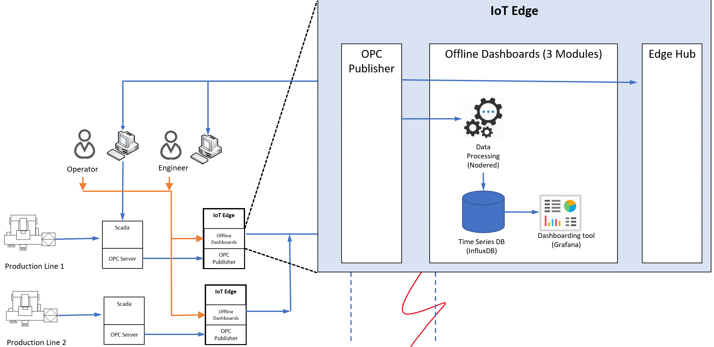

# IoT Edge offline dashboarding sample

## About this sample

As discussed in the [readme](/readme.md) for this repo, we created a sample implementation of our offline dashboarding architecture. As a significant percentage of our customers who need offline dashboarding are manufacturers, that is the use case we chose to implement. In particular, we show the necessary data collection, calculations, and visualization of the Overall Equipment Efficiency (OEE) metric, common to manufacturers. For a deep dive in the dashboard and calculations involved, please see [this document](manufacturing_kpis.md).

For guidance on how to customize the sample for other use cases, please see the [customization](#customizing-the-sample-for-other-use-cases) section below.

## Business Need

Smart Manufacturing provides new opportunities to improve inefficiencies across labor, processes, machinery, materials and energy across the manufacturing lifecycle.

Azure Industrial IoT provides hybrid-cloud based components to build the end to end industrial IoT platform to enable innovation and to optimize operational processes.

Most manufacturers start their journey by providing visibility across machines, processes, lines and factories through their unified industrial IoT platform. This is achieved by collecting data from manufacturing processes to provide end to end visibility.

Different stakeholders will then make use of that platform to cater their own needs e.g planning department doing global planning or engineers monitoring and fine-tuning production phases.

Operators and users that are responsible for monitoring of operations are at the top of industrial IoT stakeholders list. They are usually responsible for well-being of operations and processes and need to have access to information in real-time. On the other hand, we also know that means of communication (infrastructure) is less than perfect in many manufacturing facilities. Although, we can provide real time access in the industrial IoT platform, what would happen if communications to cloud is cut-off? In terms of data reliability, Azure IoT Edge ensures data is accumulated when communications to cloud is broken and sent to the industrial IoT platform when facility is restored. But how can users access real time information in the meanwhile?

There are two major points this sample implementation addresses:

* Give local machine operators the ability to view telemetry and Key Performance Indicators (KPIs) during intermittent or offline internet connection scenarios.
* View near real-time telemetry and KPIs without the latency of telemetry data traveling to the cloud first.

## Solution Architecture

The Offline Dashboards sample is built upon Azure IoT Edge technology. IoT Edge is responsible for deploying and managing lifecycle of a set of modules (described later) that make up Offline Dashboards sample.

Offline Dashboards run at the IoT Edge device continuously recording data that is sent from devices to IoT Hub

The offline dashboarding sample contains 5 modules:

1. A Node-RED module that runs an OPC-UA simulator, that emulates sending data from two "sites"
2. The [OPC-UA Publisher](https://github.com/Azure/iot-edge-opc-publisher) module provided by Microsoft's Industrial IoT team, that reads OPC-UA data from the simulator and writes it to IoT Edge (via edgeHub)
3. A Node-RED module that collects data from OPC Publisher (via edgeHub) and writes that data into influxDB.
4. An InfluxDB module which stores data in time series structure
5. A Grafana module which serves data from InfluxDB in dashboards.

## Understanding the sample data, calculations, and dashboard elements

As mentioned in the introduction, our sample dashboard provides meaningful calculations of the Overall Equipment Efficiency (OEE) metric common to manufacturers. We recommend you review the [documentation](manufacturing_kpis.md) for those KPIs before proceeding to deploy the sample.

## Deployment of the sample

The first step in running the sample is to have a functioning, Linux-based IoT Edge instance (Windows support coming).  If you already have one, you can skip to the next step. If you do not, you can test the sample on an Azure VM running IoT Edge by following the instructions [here](edge-environment-prep.md).

Once you have a functioning IoT Edge environment, we are providing several options for deployment instructions, in both order of incrementing complexity, but also in order of increasing recommendation (for repeatability and being less error prone)

* [Manual](deployment-manual.md) - for manual deployment instructions leveraging the docker command line and the Azure Portal
* TODO:  -   ... TODO: pseudomanual with VS code or scripts
* [Azure DevOps](deployment-devops.md) - For integrating the build and deployment process into an Azure DevOps pipeline

## Customizing the sample for other use cases

### Component Configuration

Each of the components in the solution are driven by configuration files contained in and deployed via their corresponding Docker images. As seen later in the module deployment, we use an Azure DevOps pipeline to automate creation of the Docker images and inclusion of the correct configuration files for each solution component.  This allows you to update the dashboard, for example, by updating the corresponding dashboard configuration file and executing the pipeline.

TODO:  content coming....

### Connecting OPC Servers

### Connecting Other Devices