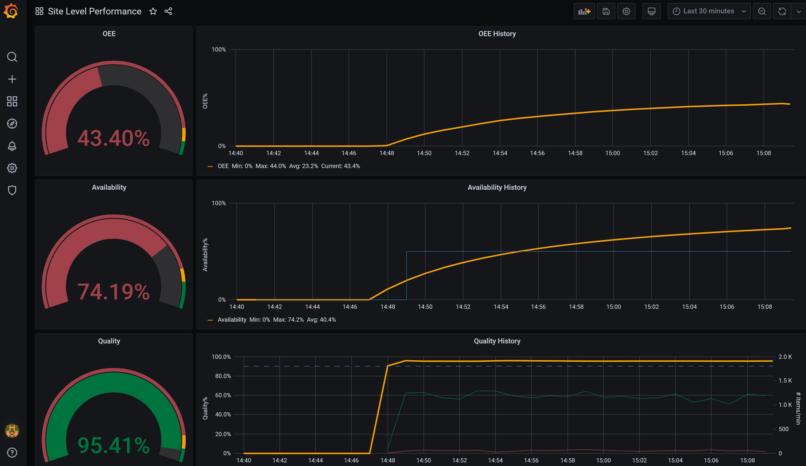

## Component Configuration

Each of the components in the solution are driven by configuration files contained in and deployed via their corresponding Docker images. As seen later in the module deployment, we use an Azure DevOps pipeline to automate creation of the Docker images and inclusion of the correct configuration files for each solution component.  This allows you to update the dashboard, for example, by updating the corresponding dashboard configuration file and executing the pipeline.

## Deployment

To deploy, we use the newest version of the Azure IoT extension, called `azure-iot`. The legacy version is called `azure-iot-cli-ext`. You should only have one version installed at a time. You can use the command `az extension list` to validate the currently installed extensions.

Use `az extension remove --name azure-cli-iot-ext` to remove the legacy version of the extension.

Use `az extension add --name azure-iot` to add the new version of the extension.

### Create Resources

Create a resource group to manage all the resources used in this solution

```bash
az group create --name {resource_group} --location {datacenter_location}
```

Use following to create the IoT Hub resource. Detailed information can be found at: <https://docs.microsoft.com/en-us/azure/iot-edge/quickstart-linux>

```bash
az iot hub create  --resource-group {resource_group} --name {hub_name} --sku S1
```

Create a device identity for your IoT Edge device so that it can communicate with your IoT Hub. The device identity lives in the cloud, and you use a unique device connection string to associate a physical device to a device identity. Detailed information can be found at: <https://docs.microsoft.com/en-us/azure/iot-edge/how-to-register-device>

```bash
az iot hub device-identity create --hub-name {hub_name} --device-id myEdgeDevice --edge-enabled
```

Retrieve the connection string for your device, which links your physical device with its identity in IoT Hub.

```bash
az iot hub device-identity show-connection-string --device-id myEdgeDevice --hub-name {hub_name}
```

Copy the value of the `connectionString` key from the JSON output and save it. This value is the device connection string. You'll use this connection string to configure the IoT Edge runtime in the next section.


We will use a virtual machine as our IoT Edge device. Microsoft-provided [Azure IoT Edge on Ubuntu](https://azuremarketplace.microsoft.com/marketplace/apps/microsoft_iot_edge.iot_edge_vm_ubuntu) virtual machine image has everything preinstalled to run Azure IoT Edge on a device. Accept the terms of use and create this virtual machine using the following command.

```bash
az vm image terms accept --urn microsoft_iot_edge:iot_edge_vm_ubuntu:ubuntu_1604_edgeruntimeonly:latest

az vm create --resource-group {resource_group} --name myEdgeVM --image microsoft_iot_edge:iot_edge_vm_ubuntu:ubuntu_1604_edgeruntimeonly:latest --admin-username azureuser --generate-ssh-keys
```

Use the edge device primary device connection string you noted above, to connect IoT Edge device to IoT Hub

```bash
az vm run-command invoke -g {resource_group} -n myEdgeVM --command-id RunShellScript --script "/etc/iotedge/configedge.sh '{device_connection_string}'"
```

### Build Module Images

Before we can deploy the edge modules needed for this solution, we need to build the module images using the Dockerfiles found in this repository.  Once built, the images need to be placed into a container registry.

Clone this repository to your local machine.

```bash
git clone https://github.com/AzureIoTGBB/iot-edge-offline-dashboarding.git
```

Next, we need to build the image for each module and push it to a container registry.  Replace {registry} in the commands below with your own registry location.

```bash
sudo docker login {registry}

cd iot-edge-offline-dashboarding/modules/edge-to-influxdb
sudo docker build --tag {registry}/edge-to-influxdb:1.0 .
sudo docker push {registry}/edge-to-influxdb:1.0

cd ../grafana
sudo docker build --tag {registry}/grafana:1.0 .
sudo docker push {registry}/grafana:1.0

cd ../influxdb
sudo docker build --tag {registry}/influxdb:1.0 .
sudo docker push {registry}/influxdb:1.0

cd ../opc-publisher
sudo docker build --tag {registry}/opc-publisher:1.0 .
sudo docker push {registry}/opc-publisher:1.0

cd ../opc-simulator
sudo docker build --tag {registry}/opc-simulator:1.0 .
sudo docker push {registry}/opc-simulator:1.0
```

### Deploy Modules

Now that we have all five module images in a container registry, we can deploy instances of these module images to an edge machine using IoT Hub.

First, since the edge machine will need persistent storage for the InfluxDB database, we need to create a directory for the module to bind to.  Use the ssh command to login into your edge machine and run the following.

```bash
sudo mkdir /influxdata
sudo chmod 777 -R /influxdata
```

Next, you need to deploy the modules to the edge device.  Navigate to your IoT Hub in the Azure portal go to IoT Edge.  You should see your edge device.  Click on your edge device and then click "Set Modules."  In the Container Registry Credentials, put the name, address, user name and password of the registry container you used in the "Build Module Images" section of this readme.

In the IoT Edge Modules section, click the "+ Add" button and select "IoT Edge Module."  For IoT Edge Module Name put "edge-to-influxdb" and for Image URI put {registry}/edge-to-influxdb:1.0.  Be sure to replace {registry} with your own registry address.  Switch to the "Container Create Options and place the following JSON into the create options field.

```json
{
    "HostConfig": {
        "PortBindings": {
            "1880/tcp": [
                {
                    "HostPort": "1881"
                }
            ]
        }
    }
}
```

Click the "Add" button to complete the creation of the module to be deployed.  We now need to do this for the other four remaining modules.  The following are the property values to specify for each module.

Module grafana:

```json
IoT Edge Module Name: grafana
Image URI: {registry}/grafana:1.0
Environment Variable: 
    Name: GF_SECURITY_ADMIN_PASSWORD
    Value: {password}
Container Create Options:
{
    "HostConfig": {
        "PortBindings": {
            "3000/tcp": [
                {
                    "HostPort": "3000"
                }
            ]
        }
    }
}
```

Module influxdb:

```json
IoT Edge Module Name: influxdb
Image URI: {registry}/influxdb:1.0
Container Create Options:
{
    "HostConfig": {
        "Binds": [
            "/influxdata:/var/lib/influxdb"
        ],
        "PortBindings": {
            "8086/tcp": [
                {
                    "HostPort": "8086"
                }
            ]
        }
    }
}
```

Module opc-publisher:

```json
IoT Edge Module Name: opc-publisher
Image URI: {registry}/opc-publisher:1.0
Container Create Options:
{
    "Hostname": "publisher",
    "Cmd": [
        "--pf=/app/pn.json",
        "--aa"
    ]
}
```

Module opc-simulator:

```json
IoT Edge Module Name: opc-simulator
Image URI: {registry}/opc-simulator:1.0
Container Create Options:
{
    "HostConfig": {
        "PortBindings": {
            "1880/tcp": [
                {
                    "HostPort": "1880"
                }
            ]
        }
    }
}
```

You should now have the following in your set modules dialog:


Next, we need to establish a route in the "Routes" tab.  Click on the "Routes" tab and add the following route with the name "opc":

```
FROM /messages/modules/opc-publisher/* INTO BrokeredEndpoint("/modules/edge-to-influxdb/inputs/input1")
```


You are now ready to deploy the modules to your edge machine.  Click the "Review + Create" button and then the "Create" button.  This will kick off the deployment.  If all goes well you should see all modules running after several minutes.  IoT Edge Runtime Response should be "200 -- Ok" and you should see all modules runtime status as "running."


### View Grafana Dashboard

Now that the edge modules are successfully running, you can view the running Grafana dashboard.  First, make sure you have opened port 3000 on your edge VM.  

az vm open-port --resource-group {resource_group} --name {edge_VM_name} --port 3000

Next, replace the {ip-address} in the following link with your own VM ip address and navigate to that site:

```http
http://{ip-address}:3000/
```

Login to Grafana using "admin" as user name and the password you specified in the "GF_SECURITY_ADMIN_PASSWORD" environment variable you created in grafana module options.  Once you have logged into Grafana, click the gear icon on the left-hand panel and select data sources.  You should see the "myinfluxdb" data source.  Click on it to navigate into the settings.  Click the "Save & Test" button at the bottom.  If things are working properly you should see "Data source connected and database found."    

Next, hover over the dashboard icon in the left side panel and click "Manage."  You should see the "Site Level Performance" dashboard under the General folder.  Click on it to open the dashboard.  You should see the fully running dashboard like below:

