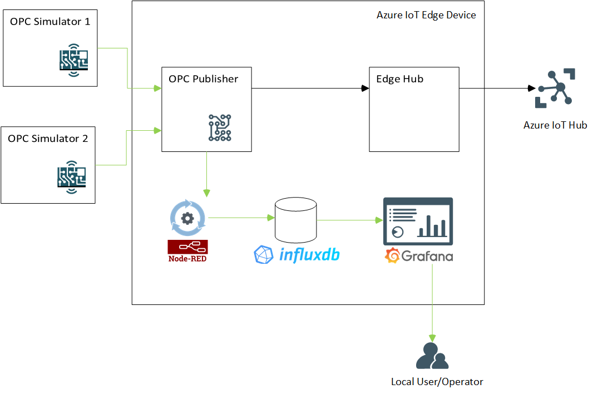
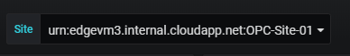
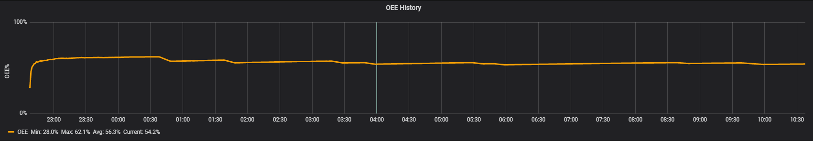
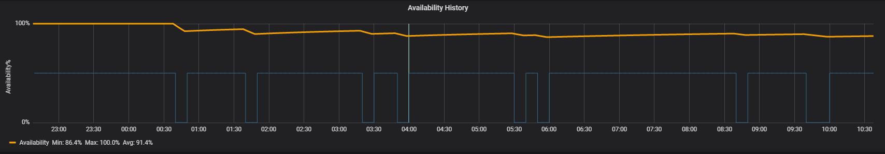
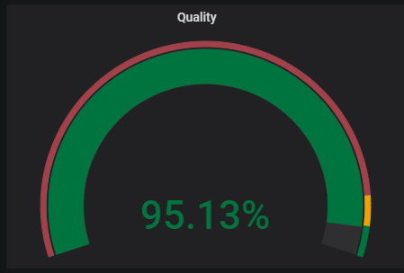
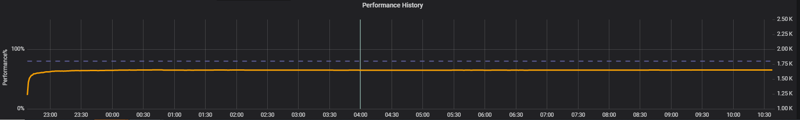

# IoT Dashboarded Edge samples - OEE drilldown

## Manufacturing KPIs

Our Offline Dashboards solution includes a sample dashboard to display OEE and its component KPIs in manufacturing environment.

**Performance:** Performance KPI indicates if the machine is manufacturing good items as much as it is expected. It is calculated as

```html
Performance = (Good Items Produced/Total Time Machine was Running)/(Ideal Rate of Production)
```

where "Ideal Rate of Production" is what we expect machine to perform. The unit of KPI is percentage and "Ideal Rate of Production" is provided as a parameter to dashboards.

**Quality:** Quality KPI gives you the ratio of good items produced by the machine over all items produced (i.e. good items produced and bad items produced). Calculation formula is

```html
Quality = (Good Items Produced)/(Good Items Produced + Bad Items Produced)
```

The unit of KPI is percentage.

**Availability:** Availability is defined as percentage of time the machine was available. Normally, this does not include any time periods where there is not any planned production. However, for the sake of simplicity, we assume here that our factory operates 24x7.

The calculation formula is

```html
Availability = (Running Time)/(Running Time + Idle Time)
```

The unit of KPI is percentage.

**OEE (Operational Equipment Effectiveness):** Finally, OEE is a higher level KPI that is calculated from other KPIs above and depicts overall efficiency of equipment and manufacturing processes. The calculation formula is

```html
OEE = Availability x Quality x Performance
```

The unit of KPI is percentage.

## Sample Data Sources and Flow

The flow of data within the offline dashboards sample is depicted by green arrows in the following diagram.



* Two simulators act as OPC servers
* OPC Publisher subscribes to 3 data points in OPC Servers
* Data collected by OPC Publisher is sent to cloud (through Edge Hub module) AND relayed to offline dashboards Node-RED module for processing.
* Node-RED module unifies data format and writes data into InfluxDB
* Grafana dashboards read data from InfluxDB and display dashboards to operators/users.
* OPC Publisher, Node-RED module, InfluxDB and Grafana are all deployed as separate containers through IOT Edge runtime.
* For sake of simplicity, two OPC simulators are also deployed as Node-RED modules in a container through IoT Edge runtime.

### OPC Simulator

This example solution uses an [OPC simulator](https://flows.nodered.org/node/node-red-contrib-opcua) to simulate data flow coming from machines in manufacturing environment.

OPC Simulator is a flow implemented in Node-Red. Two simulators are used to simulate two different OPC servers connected to the same IOT Edge device.

| OPC Simulator Flow 1                          | OPC Simulator Flow 2                           |
| --------------------------------------------- | ---------------------------------------------- |
|  |  |

Simulators essentially have the same template but differentiated by two settings: Product URI and Port

|                      | Product URI | Port  |
| -------------------- | ----------- | ----- |
| OPC Simulator Flow 1 | OPC-Site-01 | 54845 |
| OPC Simulator Flow 2 | OPC-Site-02 | 54855 |

Three data points are generated by the simulators:

#### Data Point: STATUS

STATUS indicates the current status of device that OPC server is connected to.  STATUS values are randomly generated using following rules

* Value changes at least 10min intervals
* STATUS value is one of the following: 101,105,108, 102,104,106,107,109
* STATUS Values 101, 105, 108 mean machine is running
* STATUS Values 102,104,106,107,109 mean machine is not running
* Random number generator ensures machine will be in RUNNING state (i.e. STATUS 101,105,108) 90% of the time

#### Data Point: ITEM_COUNT_GOOD

ITEM_COUNT_GOOD indicates number of good items (products that pass quality) produced by the machine since the last data point. It is a random whole number between 80-120. Simulators generate item counts every 5 secs. This could be taken in any unit that you wish but we will regard it as "number of items" in this example.

#### Data Point: ITEM_COUNT_BAD

ITEM_COUNT_BAD indicates number of bad items (ITEMS_DISCARDED) produced by the machine since the last data point. It is a random whole number between 0-10. Simulators generate item counts every 5 secs. This could be taken in any unit that you wish but we will regard it as "number of items" in this example.

### Data Processing Module (Node-RED)

Data collected from simulators by OPC publisher module are sent to Node-RED module for processing. Node-RED module does minimal processing as to validate data and convert to a suitable format and writes data into InfluxDB.

During processing Application URI value is extracted from JSON data and written to "Source" tag in the database schema.

### Database (InfluxDB)

All data collected flows into a single measurement (DeviceData) in a single database (telemetry) in InfluxDB. The measurement "DeviceData" has 3 fields and 1 tag:

Fields

* STATUS: float
* ITEM_COUNT_GOOD: float
* ITEM_COUNT_BAD: float

Tags

* Source

Note that STATUS values are preserved as they come from the OPC Server. We map these values to determine if machine is running with influx queries.

### Dashboard: Site Level Performance

Site Level Performance dashboard displays key manufacturing KPIs (OEE, Availability, Quality, Performance) per site.


**Site** is basically defined as the OPC server that provides data and uses OPC Server's Application URI as the site name (Source). See Node-RED module code for algorithm producing Application URI. In the sample application we have two different sites that corresponding to two OPC Simulators



**Ideal run rate** is the ideal capacity of production for the equipment. It is used to calculate Performance KPI. See definition for Performance KPI for the calculation method.


Each row in the dashboard represents a KPI. The gauge on the left-hand side gives calculation of KPI as per the time window selected. In the example screenshot above, selected time window is "Last 12 hours". Therefore, the left top gauge for OEE KPI says that OEE value is at 54.23% for the last 12 hours.


Normally operators would like to monitor KPIs for their current shift. To do that the operator has to set start of time period as start of their shift and leave end of time period as "now()", as shown in the snapshot below


To make it easier, line graphs on the right column has vertical lines on 12:00AM, 08:00AM and 04:00PM to indicate working shift changes in our fictional facility.

Following table depicts details of each element in the dashboard

| Dashboard Element                                            |                     Snapshot                      |
| ------------------------------------------------------------ | :-----------------------------------------------: |
| OEE gauge shows OEE KPI for the time period selected.        |                    |
| OEE graph shows OEE value change across time period selected. Minimum, Maximum, Average values of OEE across time period are provided in the legend. |                    |
| Availability gauge shows Availability KPI for the time period selected. |  |
| Availability graph shows Availability value change across time period selected. Minimum, Maximum, Average values of Availability across time period are provided in the legend. The blue line indicates when machine was actually running. |  |
| Quality gauge shows Quality KPI for the time period selected. |            |
| Quality graph shows Quality value change across time period selected on the left axis. It also shows the number of "Good Items" produced (items that are properly manufactured, as green line) as well as "Bad Items" produced (items that are discarded, as red line) aligned to right axis. Contrary to Quality KPI "Good Items"  and "Bad Items" are aggregated at the minute level and their unit is number of items/min. "Ideal Run Rate" parameter value, entered manually at the top of dashboard, is shown as a reference line, again, aligned to the right axis. Minimum, Maximum, Average values of Quality, Good Items and Bad Items are provided in the legend. |            |
| Performance gauge shows Performance KPI for the time period selected. |    |
| Performance graph shows Performance value change across time period selected. Minimum, Maximum, Average values of Performance across time period are provided in the legend. "Ideal Run Rate" parameter value, entered manually at the top of dashboard, is shown as a reference line, again, aligned to the right axis. |    |
