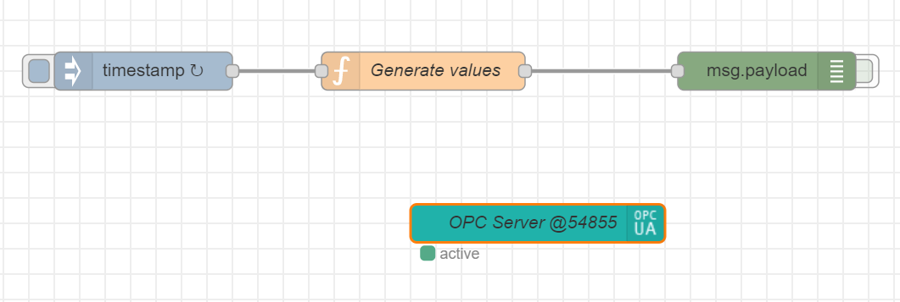
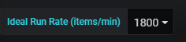
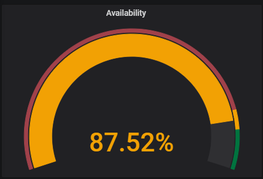

# IoT Dashboarded Edge samples - OEE drilldown

## Manufacturing KPIs

Our Offline Dashboards solution includes a sample dashboard to display OEE and its component KPIs in manufacturing environment.

**Performance:** Performance KPIs indicate whether a machine is manufacturing good items as much as is expected. It is calculated as

```html
Performance = (Good Items Produced/Total Time Machine was Running)/(Ideal Rate of Production)
```

where "Ideal Rate of Production" is what the machine is expected to produce. The unit of the performance KPI is percentage (%) and "Ideal Rate of Production" is provided as a parameter to dashboards.

**Quality:** Quality KPI gives you the ratio of good items produced by the machine over all items produced (i.e. good items produced and bad items produced). The formula is

```html
Quality = (Good Items Produced)/(Good Items Produced + Bad Items Produced)
```

The unit for Quality KPI is percentage (%).

**Availability:** Availability is defined as percentage of time the machine was available. Normally, this does not include any time periods where there is not any planned production. However, for the sake of simplicity, we assume here that our factory operates 24x7.

The formula is

```html
Availability = (Running Time)/(Running Time + Idle Time)
```

The unit for the Availability KPI is percentage (%).

**OEE (Operational Equipment Effectiveness):** Finally, OEE is a higher level KPI that is calculated from other KPIs above and depicts overall efficiency of equipment and manufacturing processes. The calculation formula is

```html
OEE = Availability x Quality x Performance
```

The unit for the OEE KPI is percentage (%).


## Sample Data Sources and Flow

The flow of data within the offline dashboards sample is depicted by green arrows in the following diagram.


* Two simulators act as OPC servers
* OPC Publisher subscribes to 3 data points in OPC Servers
* Data collected by the OPC Publisher is sent to cloud (through Edge Hub module) AND in parallel route to the offline dashboards Node-RED module for processing.
* Node-RED module unifies data format and writes data into the InfluxDB
* Grafana dashboards read data from InfluxDB and display dashboards to operators/users.
* OPC Publisher, Node-RED module, InfluxDB and Grafana are all deployed as separate containers through IOT Edge runtime.
* For sake of simplicity, two OPC simulators are also deployed as Node-RED modules in a container through IoT Edge runtime.

### OPC Simulator

This example solution uses an [OPC simulator](https://flows.nodered.org/node/node-red-contrib-opcua) to simulate data flow coming from machines in a manufacturing environment.

OPC Simulator is a flow implemented in Node-Red. Two simulators are used to simulate two different OPC servers connected to the same IOT Edge device.

| OPC Simulator Flow 1                          | OPC Simulator Flow 2                           |
| --------------------------------------------- | ---------------------------------------------- |
|  |  |

Simulators essentially have the same template but differentiated by two settings: Product URI and Port

|                      | Product URI | Port  |
| -------------------- | ----------- | ----- |
| OPC Simulator Flow 1 | OPC-Site-01 | 54845 |
| OPC Simulator Flow 2 | OPC-Site-02 | 54855 |

The OPC simulators generate three data points:

#### Data Point: STATUS

STATUS indicates the current status of device that the OPC server is connected to. STATUS values are randomly generated using following rules

* Value changes at least 10min intervals
* STATUS value is one of the following: 101,105,108, 102,104,106,107,109
* STATUS Values 101, 105, 108 indicates that the machine is running
* STATUS Values 102, 104, 106, 107, 109 indicates that the machine is not running
* Random number generator ensures machine will be in RUNNING state (i.e. STATUS 101,105,108) 90% of the time

#### Data Point: ITEM_COUNT_GOOD

ITEM_COUNT_GOOD indicates the number of good items (products that pass quality tests) produced by the machine since the last data point. It is a random whole number between 80-120. Simulators generate item counts every 5 secs. This could be taken in any unit that you wish but we will regard it as "number of items" in this example.

#### Data Point: ITEM_COUNT_BAD

ITEM_COUNT_BAD indicates the number of bad items (ITEMS_DISCARDED) produced by the machine since the last data point. It is a random whole number between 0-10. Simulators generate item counts every 5 secs. This could be taken in any unit that you wish but we will regard it as "number of items" in this example.

### Data Processing Module (Node-RED)

Data collected from simulators by the OPC publisher module are sent to the Node-RED module for processing. The Node-RED module does minimal processing. It's role is to validate data, convert it to a suitable format and write the data into the InfluxDB.

During processing, the Application URI value is extracted from JSON data and written to the "Source" tag in the database schema.

### Database (InfluxDB)

All data collected flows into a single measurement (DeviceData) in a single database (telemetry) in InfluxDB. The measurement "DeviceData" has 3 fields and 1 tag:

Fields

* STATUS: float
* ITEM_COUNT_GOOD: float
* ITEM_COUNT_BAD: float

Tags

* Source

Note that STATUS values are preserved as they come from the OPC Server. We map these values to determine if the machine is running using influx queries.

### Dashboard: Site Level Performance

Site Level Performance dashboard displays key manufacturing KPIs (OEE, Availability, Quality, Performance) per site.  


**Site** is basically defined as the OPC server that provides data and uses OPC Server's Product URI as the site name (Source). See Node-RED module code for the algorithm used to extract Product URI from Node Id. 

In real implementations, site will correspond to a specific equipment or asset. 

In the sample application we have two different sites that corresponding to two OPC Simulators


**Ideal run rate** is the ideal capacity of production for the equipment. It is used to calculate the Performance KPI. See the definition for Performance KPI for the method of calculation.



Each row in the dashboard represents a KPI. The gauge on the left-hand side gives calculation of KPI as per the time window selected. In the example screenshot above, selected time window is "Last 12 hours". Therefore, the left top gauge for OEE KPI corresponds to an OEE value at 54.23% over the last 12 hours.


Normally operators would monitor KPIs for the current shift. To do that, the operator would need to set time range that the graphs display - the "from" field should be set to the start of the shift and leave the "to" field/end of time period as "now", as shown in the snapshot below


To make it easier, line graphs on the right column has vertical lines on 12:00AM, 08:00AM and 04:00PM to indicate working shift changes in our fictional facility.

Following table depicts details of each element in the dashboard

| Dashboard Element                                            |                     Snapshot                      |
| ------------------------------------------------------------ | :-----------------------------------------------: |
| OEE gauge shows OEE KPI for the time period selected.        |                    |
| OEE graph shows OEE value change across time period selected. Minimum, Maximum, Average values of OEE across time period are provided in the legend. |                    |
| Availability gauge shows Availability KPI for the time period selected. |  |
| Availability graph shows Availability value change across time period selected. Minimum, Maximum, Average values of Availability across time period are provided in the legend. The blue line indicates when machine was actually running. |  |
| Quality gauge shows Quality KPI for the time period selected. |            |
| Quality graph shows Quality value change across time period selected on the left axis. It also shows the number of "Good Items" produced (items that are properly manufactured, as green line) as well as "Bad Items" produced (items that are discarded, as red line) aligned to right axis. Contrary to Quality KPI "Good Items"  and "Bad Items" are aggregated at the minute level and their unit is number of items/min. "Ideal Run Rate" parameter value, entered manually at the top of dashboard, is shown as a reference line, again, aligned to the right axis. Minimum, Maximum, Average values of Quality, Good Items and Bad Items are provided in the legend. |            |
| Performance gauge shows Performance KPI for the time period selected. |    |
| Performance graph shows Performance value change across time period selected. Minimum, Maximum, Average values of Performance across time period are provided in the legend. "Ideal Run Rate" parameter value, entered manually at the top of dashboard, is shown as a reference line, again, aligned to the right axis. |    |

#### Building "Site Level Performance" Dashboard 

The instructions below describe the various settings and queries that are used to build the tiles in the dashboard. 

##### Variables

The dashboard is configured using two main variables that can be defined under the dashboard settings. 
At the top right of the dashboard, click the gear button ("Dashboard settings") and under the *Variables* tab, you will see the following variables: 

*$idealRunrate* is defined as a constant value (1400) which indicates the ideal throughput of the equipment/asset. This variable is used to calculate Performance KPI and Quality KPI.

*$Source* is defined as a query from influxdb database which pulls available "Source" tags from "DeviceData" measurement. This is essentially a list of assets we have measurements in the selected time range ($range).

`

```
from(bucket: "telemetry")
  |> range($range)
  |> filter(fn: (r) =>r._measurement == "DeviceData")
  |> keep(columns:["Source"])
  |> distinct(column: "Source")
```

##### Panels

Dashboard contains 8 panels which are built on different but similar Flux queries from the same data source. Most comprehensive of these queries is used in OEE History since OEE calculation actually involves calculating other KPIs. (see Manufacturing KPIs above)

###### OEE History Panel


OEE History panel uses following Flux query.

Import "math" and "csv" packages and define mapping for STATUS field values. Here it says that STATUS values 101,105 and 108 will be considered as asset is in RUNNING state.

```
import "math"

import "csv"

StatusValuesForOn = [101,105,108]
```


*fGetLastStatus* function finds the last STATUS value before currently displayed time range. Simulator changes STATUS values every 10 minutes and OPC Server does not publish if the new value is the same as previous one. At any time, STATUS value should be considered as the last set value.  

```
fGetLastStatus = () => {
```

We define a dummy record to avoid error from tableFind function later.

```
dummyRecordCsv = "#datatype,string,long,dateTime:RFC3339,dateTime:RFC3339,dateTime:RFC3339,double,string,string,string\n#group,false,false,true,true,false,false,true,true,true\n#default,_result,,,,,,,,\n,result,table,_start,_stop,_time,_value,Source,_field,_measurement\n,,0,2030-01-01T00:00:00.0Z,2030-01-01T00:00:00.0Z,2030-01-01T00:00:00.0Z,0,,STATUS,DeviceData"

dummyRecord=csv.from(csv: dummyRecordCsv )
```

First we find the first STATUS value in the current time range, for the selected asset ([[Source]]) 

```
firstStatusTimestampTemp=
  from(bucket: "telemetry")
  |> range([[range]])
  |> filter(fn: (r) => r._measurement == "DeviceData" )
  |> filter(fn: (r) => r.Source       == "[[Source]]" )
  |> filter(fn: (r) => r._field       == "STATUS" )
  |> first()
```

We then union the result with a dummy record so that result will have at least one table even if we don't have any STATUS values in the current time range ([[range]]) . Otherwise tableFind function raises error.

```
firstStatusTimestamp=
  union(tables: [firstStatusTimestampTemp,dummyRecord])
  |> tableFind(fn: (key) => key._field == "STATUS"  )
  |> getColumn(column: "_time")
```

Then we search for the last (latest) STATUS value before the first (oldest) STATUS value we have in selected time range. Note that in later versions of Grafana connector (7.0+) for Flux, you don't need to search for the first value in range, you can just use the start of time range moniker (*v.timeRangeStart*) and search for latest status value before *v.timeRangeStart*. 

```
lastStatusBeforeRangeTemp=
from(bucket: "telemetry")
  |> range(start:-1000d, // Flux queries have to have the start of a range, 
                         // make sure start of range is old enough to cover all cases
           stop: time(v:uint(v:firstStatusTimestamp[0])-uint(v:1)))
  |> filter(fn: (r) => r._measurement == "DeviceData" )
  |> filter(fn: (r) => r.Source       == "[[Source]]" )
  |> map(fn: (r) => ({
         _field: "STATUS",
         _time: r._time, 
         _value: float(v: contains(value: int(v: r._value),
                                   set  : StatusValuesForOn ))//If STATUS value is one of StatusValuesForOn
                                                              // then return 1.0f else 0.0f
     }))
  |> last()
```


Union the result with a dummy record so that result will have at least one table even if we don't have any STATUS values before current time range ([[range]]) . Otherwise *tableFind* function raises error.

```
lastStatusBeforeRange=
     union(tables: [lastStatusBeforeRangeTemp,dummyRecord])
  |> tableFind(fn: (key) => key._field == "STATUS"  )
  |> getColumn(column: "_value")
```

  Finally following returns the latest STATUS value (as 1 or 0)

```
return lastStatusBeforeRange[length(arr:lastStatusBeforeRange)-1]
}
```

Filter all Fields (measurements: ITEM_COUNT_GOOD, ITEM_COUNT_BAD, STATUS) for the selected time range ([[range]]) and selected asset ([[Source]]). This is our base query template.

```
DeviceData=from(bucket: "telemetry")
  |> range([[range]])
  |> filter(fn: (r) => r._measurement == "DeviceData" )
  |> filter(fn: (r) => r.Source       == "[[Source]]" )
  |> group() //remove any grouping
  |> keep(columns: ["_time","_field","_value"])
```

Extract field ITEM_COUNT_GOOD, sum them in 1minute intervals and calculate cumulative sum.

```
ItemCountGoodData=
  DeviceData
  |> filter(fn: (r) => r._field == "ITEM_COUNT_GOOD" )
  |> aggregateWindow(every: 1m, fn: sum)
  |> cumulativeSum()
```


Extract field ITEM_COUNT_BAD, sum them in 1minute intervals and calculate cumulative sum.

```
ItemCountBadData=
  DeviceData
  |> filter(fn: (r) => r._field == "ITEM_COUNT_BAD" )
  |> aggregateWindow(every: 1m, fn: sum)
  |> cumulativeSum()
```

Extract field STATUS, convert STATUS values to 0.0 or 1.0.  STATUS values in set StatusValuesForOn are mapped to 1.0 rest are mapped to 0.0. 

```
StatusData=
  DeviceData
  |> filter(fn: (r) =>  r._field == "STATUS")
  |> map(fn: (r) => ({
        _time: r._time, 
        _value: float(v: contains(value: int(v: r._value), 
                                  set: StatusValuesForOn ))

  }))
```


Extract field STATUS, average them in 1minute intervals. If average is >0 for any 1 minute interval, we consider that asset is running in that interval .

```
StatusDataWindowed=
  StatusData
  |> aggregateWindow(every: 1m, fn: mean)      //calculate STATUS (1 or 0) for each 1 min window
  |> fill(column: "_value", usePrevious: true) // if there are no values in any window, use previous status
  |> fill(column: "_value", value: fGetLastStatus()) //if there's no previous STATUS (i.e number of null
                                                     //records in the beginning of the range), calculate 
                                                     //the last status before range starts
  |> map(fn: (r) => ({_time: r._time, _value: math.ceil(x: r._value)}))
```

  Calculate cumulative sum over STATUS so that each row gives number of running minutes from the start of range.

```
RunningMins=
  StatusDataWindowed
  |> cumulativeSum()
```

Calculate cumulative sum over negated STATUS so that each row gives number of idle minutes from the start of range

```
IdleMins=
  StatusDataWindowed
  |> map(fn: (r) => ({
      _value: 1.0 - r._value,
      _time: r._time,
     }))
  |> cumulativeSum()
```

Now we have all datasets needed to calculate actual KPIs so we go ahead for KPI calculations. Using cumulativeSum in calculations above will enable us to calculate all these KPIs so that each value in dataset represents KPI from the start of time range up to that row. This is especially useful because operators care most about KPI calculations in their shift and now they can set dashboard start time to the start of their shift and monitor KPIs for the tımeframe they are accountable.

Availability is defined as percentage of time equipment is running in planned production time. For sake of simplicity we assume production is planned 24x7 so we need to calculate 

​                      Total Running Time/(Total Running Time+Total Idle Time) 

 The result dataset contains a row for every minute from start of range and a _value in every row which gives the availability calculation from the start from time range

```
Availability=
  join( //join two datasets on _time, each dataset has a row for every minute from the start of range
     tables: {on: RunningMins, off: IdleMins},
     on: ["_time"]
  )
  |> map(fn: (r) => ({
      _value: if r._value_on+r._value_off == 0.0 then 0.0 
              else r._value_on/(r._value_on+r._value_off), //calculate KPI
      _time: r._time,        // set time
      _field: "Availability" //set field/KPI name
     }))
```

​    

Quality is defined as amount of good quality items produced (as opposed to defective items) over total amount produced. 

```
Quality=
  join( //join two datasets on _time, each dataset has a row for every minute from the start of range
     tables: {good: ItemCountGoodData, bad: ItemCountBadData},
     on: ["_time"]
  )
  |> map(fn: (r) => ({
      _value: if r._value_good+r._value_bad == 0.0 then 0.0 
              else r._value_good/(r._value_good+r._value_bad), //calculate KPI
      _time: r._time,   // set time
      _field: "Quality" //set field/KPI name
     }))
```


Performance is defined as amount of good quality items produced during time asset was running  compared to asset's ideal capacity ($idealRunrate) produced

```
Performance=
  join( //join two datasets on _time, each dataset has a row for every minute from the start of range
    tables: {good: ItemCountGoodData, on: RunningMins},
    on: ["_time"]
  )
  |> map(fn: (r) => ({
     _value: if r._value_on == 0.0 or float(v:$idealRunrate) == 0.0 then 0.0 
             else (r._value_good/r._value_on)/float(v:$idealRunrate), //Calculate KPI
     _time: r._time,  //set time
     _value_on : r._value_on, 
     _value_good: r._value_good,
     _field: "Performance" //set field/KPI name
    }))
```

Now that we have our base KPIs (Availability, Quality, Performance) ready we can move on to calculating OEE. Note that all KPIs come in a dataset with _time and each _value indicates KPI value from the start of time range ([[range]]).

For this purpose, we need to join 3 KPI datasets. Since Flux does not support more than 2 table joins we will use a temporary dataset to join Availability and Quality first.

```
AxQ=
  join(
    tables: {a:Availability, q: Quality},
    on: ["_time"]
  )
  |> map(fn: (r) => ({
     _value: r._value_a * r._value_q,
     _time: r._time,
     _field: "AxQ"
    }))
```

Then we will join temporary dataset with Performance KPI to calculate OEE

```
OEE=
  join(
    tables: {axq:AxQ, p: Performance},
    on: ["_time"]
  )
  |> map(fn: (r) => ({
     _value: r._value_axq * r._value_p,
     _time: r._time,
     _field: "OEE"
    }))
  |> yield(name: "OEE") // use yield function to materialize dataset
```

###### OEE Gauge

OEE Gauge displays KPI value from the start of [[range]] to the end of [[range]]. Therefore, its Flux query basically contains sum() instead of *cumulativeSum()* and resulting datasets contain one record rather than a record for every minute.

Below is the Flux query for OEE Gauge with differences from OEE History panel query marked with `//****`.

```
import "math"
import "csv"

StatusValuesForOn = [101,105,108]

fGetLastStatus = () => {

dummyRecordCsv = "#datatype,string,long,dateTime:RFC3339,dateTime:RFC3339,dateTime:RFC3339,double,string,string,string\n#group,false,false,true,true,false,false,true,true,true\n#default,_result,,,,,,,,\n,result,table,_start,_stop,_time,_value,Source,_field,_measurement\n,,0,2030-01-01T00:00:00.0Z,2030-01-01T00:00:00.0Z,2030-01-01T00:00:00.0Z,0,,STATUS,DeviceData"

dummyRecord=csv.from(csv: dummyRecordCsv )

firstStatusTimestampTemp=
  from(bucket: "telemetry")
  |> range([[range]])
  |> filter(fn: (r) => r._measurement == "DeviceData" )
  |> filter(fn: (r) => r.Source       == "[[Source]]" )
  |> filter(fn: (r) => r._field       == "STATUS" )
  |> first()

firstStatusTimestamp=
     union(tables: [firstStatusTimestampTemp,dummyRecord])
  |> tableFind(fn: (key) => key._field == "STATUS"  )
  |> getColumn(column: "_time")

lastStatusBeforeRangeTemp=
from(bucket: "telemetry")
  |> range(start:-1000d, 
           stop: time(v:uint(v:firstStatusTimestamp[0])-uint(v:1)))
  |> filter(fn: (r) => r._measurement == "DeviceData" )
  |> filter(fn: (r) => r.Source       == "[[Source]]" )
  |> map(fn: (r) => ({
        _field: "STATUS",
        _time: r._time, 
        _value: float(v: contains(value: int(v: r._value),
                                  set  : StatusValuesForOn ))
      }))
  |> last()

lastStatusBeforeRange=
     union(tables: [lastStatusBeforeRangeTemp,dummyRecord])
  |> tableFind(fn: (key) => key._field == "STATUS"  )
  |> getColumn(column: "_value")         

return lastStatusBeforeRange[length(arr:lastStatusBeforeRange)-1]
}

DeviceData=from(bucket: "telemetry")
  |> range([[range]])
  |> filter(fn: (r) => r._measurement == "DeviceData" )
  |> filter(fn: (r) => r.Source       == "[[Source]]" )
  |> group()
  |> keep(columns: ["_time","_field","_value"])

ItemCountGoodData=
  DeviceData
  |> filter(fn: (r) => r._field == "ITEM_COUNT_GOOD" )
  |> aggregateWindow(every: 1m, fn: sum)
  |> sum()  //****
  |> map(fn: (r) => ({
     _value: r._value,
     _time: now()
    }))

ItemCountBadData=
  DeviceData
  |> filter(fn: (r) => r._field == "ITEM_COUNT_BAD" )
  |> aggregateWindow(every: 1m, fn: sum)
  |> sum()  //****
  |> map(fn: (r) => ({
     _value: r._value,
     _time: now()
    }))

StatusData=
  DeviceData
  |> filter(fn: (r) =>  r._field == "STATUS")
  |> map(fn: (r) => ({
      _time: r._time, 
      _value: float(v: contains(value: int(v: r._value), 
                                       set: StatusValuesForOn ))
  }))

StatusDataWindowed=
  StatusData
  |> aggregateWindow(every: 1m, fn: mean)
  |> fill(column: "_value", usePrevious: true) 
  |> fill(column: "_value", value: fGetLastStatus()) 
  |> map(fn: (r) => ({_time: r._time, _value: math.ceil(x: r._value)}))

RunningMins=
  StatusDataWindowed
  |> sum()  //****
  |> map(fn: (r) => ({
     _value: r._value,
     _time: now()
    }))

IdleMins=
  StatusDataWindowed
  |> map(fn: (r) => ({
     _value: 1.0 - r._value,
     _time: r._time,
    }))
  |> sum()  //****
  |> map(fn: (r) => ({
     _value: r._value,
     _time: now()
    }))

Availability=
  join(
    tables: {on: RunningMins, off: IdleMins},
    on: ["_time"]
  )
  |> map(fn: (r) => ({
     _value: if r._value_on+r._value_off == 0.0 then 0.0 
             else r._value_on/(r._value_on+r._value_off),
     _time: r._time,
     _field: "Availability"
    }))

Quality=
  join(
    tables: {good: ItemCountGoodData, bad: ItemCountBadData},
    on: ["_time"]
  )
  |> map(fn: (r) => ({
     _value: if r._value_good+r._value_bad == 0.0 then 0.0 
             else r._value_good/(r._value_good+r._value_bad),
     _time: r._time,
     _field: "Quality"
    }))

Performance=
  join(
    tables: {good: ItemCountGoodData, on: RunningMins},
    on: ["_time"]
  )
  |> map(fn: (r) => ({
     _value: if r._value_on == 0.0 or float(v:$idealRunrate) == 0.0 then 0.0 
             else (r._value_good/r._value_on)/float(v:$idealRunrate),
     _time: r._time,
     _value_on : r._value_on, _value_good: r._value_good,
     _field: "Performance"
    }))

AxQ=
  join(
    tables: {a:Availability, q: Quality},
    on: ["_time"]
  )
  |> map(fn: (r) => ({
     _value: r._value_a * r._value_q,
     _time: r._time,
     _field: "AxQ"
    }))

OEE=
  join(
    tables: {axq:AxQ, p: Performance},
    on: ["_time"]
  )
  |> map(fn: (r) => ({
     _value: r._value_axq * r._value_p,
     _time: r._time,
     _field: "OEE"
    }))
  |> yield(name: "OEE")
```


