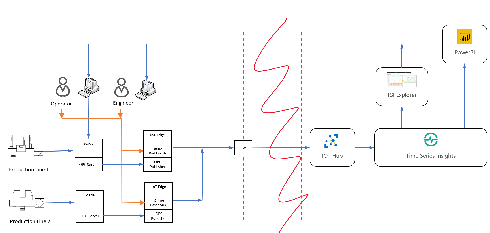

# IoT Offline Dashboarding sample

As discussed in the [readme](/readme.md) for this project, this use case and architecture was chosen as a significant percentage of Microsoft customers showed interest in offline dashboarding solutions. 

Many of the requests came out of the manufacturing industry, which is why the example is based on a manufacturing scenario. In particular, the sample includes the necessary data collection, calculations, and visualization of the Overall Equipment Effectiveness (OEE) metric, common to manufacturers. For a deep dive of the metrics and calculations involved, please see [this document](manufacturing-kpis.md).

More information on the deployment of the sample can be found [here](#deployment-of-the-sample).

For guidance on how to customize the sample for other use cases, please see the [customization](#customizing-the-sample-for-other-use-cases) section below.

**Table of contents**
- [IoT Offline Dashboarding sample](#iot-offline-dashboarding-sample)
  - [Business need](#business-need)
  - [Solution architecture](#solution-architecture)
  - [Understanding the sample data, calculations, and dashboard elements](#understanding-the-sample-data-calculations-and-dashboard-elements)
  - [Deploying the sample](#deploying-the-sample)
    - [View the Grafana dashboard](#view-the-grafana-dashboard)
  - [Customizing the sample](#customizing-the-sample)
  - [Known issues](#known-issues)

## Business need

Smart Manufacturing provides new opportunities to improve inefficiencies across labor, processes, machinery, materials and energy across the manufacturing lifecycle.

[Azure Industrial IoT](https://azure.microsoft.com/en-us/overview/iot/) provides hybrid-cloud based components to build an end to end industrial IoT platform to enable innovation and to optimize operational processes.

Most manufacturers start their journey by providing visibility across machines, processes, lines and factories through their unified industrial IoT platform. This is achieved by collecting data from manufacturing processes to provide end to end visibility.

Different stakeholders will then make use of that platform to cater their own needs e.g planning department doing global planning or engineers monitoring and fine-tuning production phases.

Operators and users that are responsible for monitoring of operations are at the top of industrial IoT stakeholders list. They are usually responsible for well-being of operations and processes and need to have access to information in real-time. On the other hand, we also know that means of communication (infrastructure) is less than perfect in many manufacturing facilities. Although, we can provide real time access in the industrial IoT platform, what would happen if communication to cloud is cut-off? In terms of data reliability, Azure IoT Edge ensures data is accumulated when communication to cloud is broken and sent to the industrial IoT platform when cloud communication is restored. But how can users access real time information in the meanwhile?

There are two major concerns this sample implementation addresses:

* Give local machine operators the ability to view telemetry and Key Performance Indicators (KPIs) during intermittent or offline internet connection scenarios.
* View near real-time telemetry and KPIs without the latency of telemetry data traveling to the cloud first.

## Solution architecture

The "Offline Dashboards" sample is built upon [Azure IoT Edge](https://azure.microsoft.com/en-us/services/iot-edge/) technology. IoT Edge is responsible for deploying and managing lifecycle of a set of modules (described later) that make up Offline Dashboards sample.

Offline Dashboards runs on the IoT Edge device, continuously recording data that is sent from devices to IoT Hub



The offline dashboarding sample contains 5 modules:

1. A Node-RED module that runs an OPC-UA simulator, that emulates sending data from two "sites"
2. The [OPC-UA Publisher](https://github.com/Azure/iot-edge-opc-publisher) module provided by Microsoft's Industrial IoT team, that reads OPC-UA data from the simulator and writes it to IoT Edge (via edgeHub)
3. A Node-RED module that collects data from OPC Publisher (via edgeHub) and writes that data into influxDB.
4. An InfluxDB module which stores data in time series structure
5. A Grafana module which serves data from InfluxDB in dashboards.


## Understanding the sample data, calculations, and dashboard elements

The sample dashboard provides meaningful calculations of the Overall Equipment Effectiveness (OEE) metric common to manufacturers. There is a [documentation on how these KPIs are defined and calculated](manufacturing-kpis.md).

## Deploying the sample

The first step in running the sample is to have a functioning, Linux-based IoT Edge instance (Windows support coming). You can set one up by following the instructions [here](setup-edge-environment.md).

Once you have a functioning IoT Edge environment, the sample provides several options for deployment, in both order of incrementing complexity and in order of increasing recommendation (for repeatability and being less error prone):

* [Manual](deployment-manual.md) - For manual deployment instructions, leveraging the Docker command line and the Azure Portal
* [Visual Studio Code](deployment-vscode.md) - For bulding and deploying to a single IoT Edge device via VS Code
* [Azure DevOps](deployment-devops.md) - For integrating the build and deployment process into an Azure DevOps pipeline

### View the Grafana dashboard

Verify that the IoT Edge modules are indeed running by viewing the running Grafana dashboard. To do that, replace the {ip-address} in the following link with your own VM ip address and open the URL with a web browser:

```http
http://{ip-address}:3000/
```

Login to Grafana using "admin" as user name and the password specified in the "GF_SECURITY_ADMIN_PASSWORD" environment variable (in grafana module options).

> [!NOTE]
> There is currently a bug: For some reason, the data source details are deployed correctly, however not shown as 'enabled'. This will cause the dashboard to display an error and not show any data.
>
> When logged in, click the gear icon on the left-hand panel and select data sources -> "myinfluxdb" to navigate into the settings. Click the "Save & Test" button at the bottom. Grafana should now show "Data source connected and database found."

When the data sources are active, hover over the dashboard icon in the left side panel and click "Manage." There should be several OOE related dashboards under the General folder. Click on the "Site Performance" dashboard to get started. The resulting dashboard should look like below:


> [!NOTE]
> It may take upwards of 10 minutes for all graphs to show correctly since they rely on a history of data.

Feel free to explore the other dashboards available.

## Customizing the sample

If your use case is manufacturing / OEE and your goal is to change the data sources, this [document](customize-sample-oee.md) discusses the process and options.

If your use case is something entirely different, this [document](customize-sample-other.md) gives a high level overview of the process involved.

## Known issues

There are a few known issues with the sample that we are aware of:

* When deploying Grafana, the pre-configured datasource (myinfluxdb) is property configured, however the configuration isn't shown as 'active'. There is a manual process above to manually configure and activate it.
* The deployment of Grafana doesn't currently work with backing, host-based storage. This means that any changes made to Grafana (users, dashboards, etc) are lost if the container is removed or replaced.
