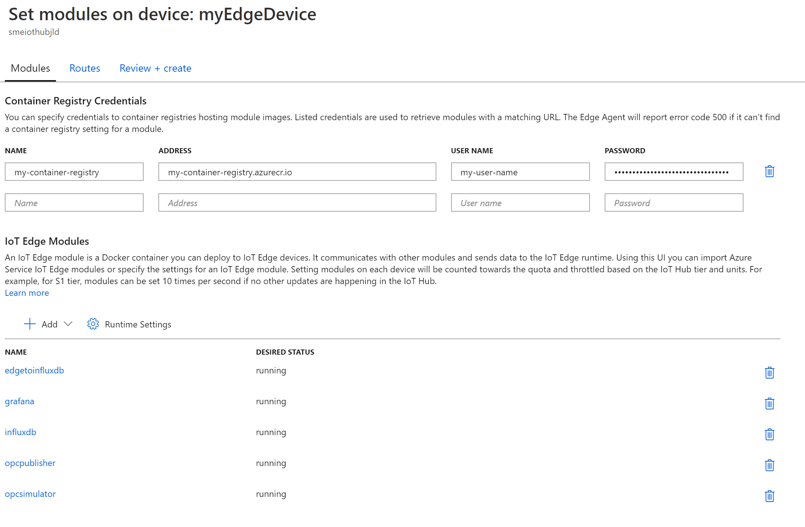
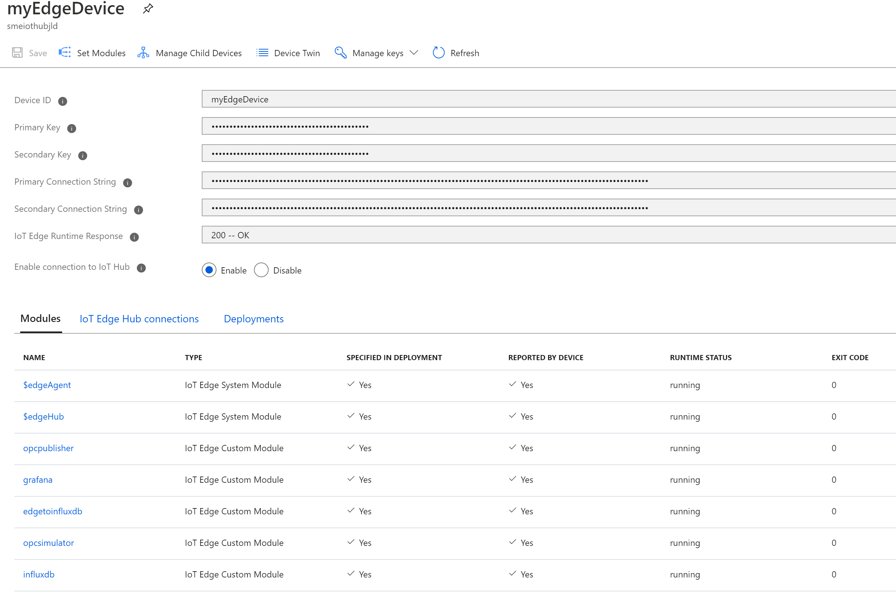

# Deploy the IoT Offline Dashboarding sample manually

This document describes how to deploy the IoT Offline Dashboarding sample manually on an Edge device. Chose this option to gain a deep understanding of every required step involved in deploying the sample.

**Table of contents**
- [Deploy the IoT Offline Dashboarding sample manually](#deploy-the-iot-offline-dashboarding-sample-manually)
  - [Preparation of Edge boxes and IoT Hub](#preparation-of-edge-boxes-and-iot-hub)
  - [Building all Edge module images](#building-all-edge-module-images)
  - [Deploying all Edge modules](#deploying-all-edge-modules)
    - [Adding the Edge modules](#adding-the-edge-modules)
    - [Adding the routes](#adding-the-routes)
    - [Deploying modules to devices](#deploying-modules-to-devices)
  - [See also](#see-also)

## Preparation of Edge boxes and IoT Hub

**Please start by setting up your Edge devices by going through the [edge environment setup](setup-edge-environment.md) document.**

## Building all Edge module images

Before any Edge modules can be deployed, it is necessary to build the module images using the Dockerfiles found in the repository. Once built, the images need to be placed into a container registry.

Start by cloning [the github repository](https://github.com/AzureIoTGBB/iot-edge-offline-dashboarding) to a machine that has docker installed (possibly the Iot Edge VM device you created above, or a local development machine)..

```bash
git clone https://github.com/AzureIoTGBB/iot-edge-offline-dashboarding.git
```

Replace `{registry}` in the commands below with the container registry location created earlier (e.g. myregistry.azurecr.io).

```bash
sudo docker login {registry}

cd iot-edge-offline-dashboarding/modules/edgetoinfluxdb
sudo docker build --tag {registry}/edgetoinfluxdb:1.0 .
sudo docker push {registry}/edgetoinfluxdb:1.0

cd ../grafana
sudo docker build --tag {registry}/grafana:1.0 .
sudo docker push {registry}/grafana:1.0

cd ../influxdb
sudo docker build --tag {registry}/influxdb:1.0 .
sudo docker push {registry}/influxdb:1.0

cd ../opcpublisher
sudo docker build --tag {registry}/opcpublisher:1.0 .
sudo docker push {registry}/opcpublisher:1.0

cd ../opcsimulator
sudo docker build --tag {registry}/opcsimulator:1.0 .
sudo docker push {registry}/opcsimulator:1.0
```

## Deploying all Edge modules

All five module images should now be in a container registry. Instances of these module images can now be deployed to an Edge machine using IoT Hub.

Navigate to the desired IoT Hub instance in the Azure portal and select "IoT Edge". All registered Edge devices should be visible. Click on the desired Edge device and click "Set Modules." In the "Container Registry Credentials", put the name, address, user name and password of the registry container used when [building the Edge module images](#building-all-edge-module-images).

### Adding the Edge modules

In the "IoT Edge Modules" section, click the "+ Add" button and select "IoT Edge Module". For "IoT Edge Module Name" enter `"edgetoinfluxdb"` and for "Image URI" enter `"{registry}/edgetoinfluxdb:1.0"`. Be sure to replace `{registry}` with the registry address defined above. Switch to the "Container Create Options" and place the following JSON into the create options field:

```json
{
    "HostConfig": {
        "PortBindings": {
            "1880/tcp": [
                {
                    "HostPort": "1881"
                }
            ]
        }
    }
}
```

Click the "Add" button to complete the creation of the module for it to be deployed. This needs to be repeated for all other four remaining modules. The following are the property values for each module.  Note: the variable {GF_SECURITY_ADMIN_PASSWORD} represents the admin password that you will use to log into the Grafana dashboards once deployment is complete.

**Module grafana:**

```json
IoT Edge Module Name: grafana
Image URI: {registry}/grafana:1.0
Environment Variable:
    Name: GF_SECURITY_ADMIN_PASSWORD
    Value: {password}
Container Create Options:
{
    "HostConfig": {
        "PortBindings": {
            "3000/tcp": [
                {
                    "HostPort": "3000"
                }
            ]
        }
    }
}
```

**Module influxdb:**

```json
IoT Edge Module Name: influxdb
Image URI: {registry}/influxdb:1.0
Container Create Options:
{
    "HostConfig": {
        "Binds": [
            "/influxdata:/var/lib/influxdb"
        ],
        "PortBindings": {
            "8086/tcp": [
                {
                    "HostPort": "8086"
                }
            ]
        }
    }
}
```

**Module opcpublisher:**

```json
IoT Edge Module Name: opcpublisher
Image URI: {registry}/opcpublisher:1.0
Container Create Options:
{
    "Hostname": "publisher",
    "Cmd": [
        "--pf=/app/pn.json",
        "--aa"
    ]
}
```

**Module opcsimulator:**

```json
IoT Edge Module Name: opcsimulator
Image URI: {registry}/opcsimulator:1.0
Container Create Options:
{
    "HostConfig": {
        "PortBindings": {
            "1880/tcp": [
                {
                    "HostPort": "1880"
                }
            ]
        }
    }
}
```

The "Set modules" dialog should now look like this:



### Adding the routes

Next, click on the "Routes" tab and add the following route with the name "opc":

```bash
FROM /messages/modules/opcpublisher/* INTO BrokeredEndpoint("/modules/edgetoinfluxdb/inputs/input1")
```


### Deploying modules to devices

Click the "Review + Create" button and then select the "Create" button. This will start the deployment. Assuming all goes well the modules will be running after several minutes. The "IoT Edge Runtime Response" should be "200 -- Ok" and the module runtime status "running".



Once confirmed that the modules are running, return to the [page on Grafana Dashboards](/documentation/dashboarding-sample.md#view-the-grafana-dashboard) to see and customize the dashboard.

## See also

* [Deploying via Azure DevOps pipelines](deployment-devops.md)
* [Deploying via VSCode](deployment-vscode.md)
