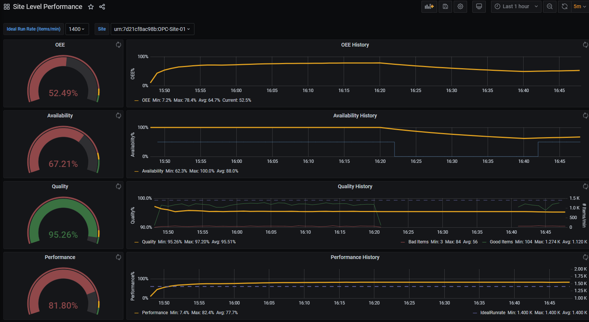
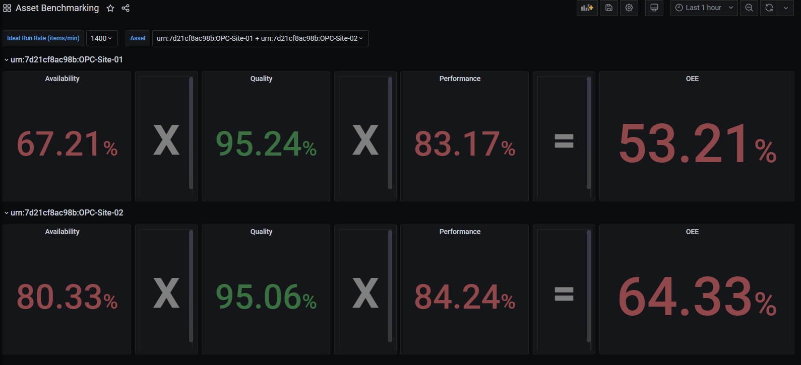
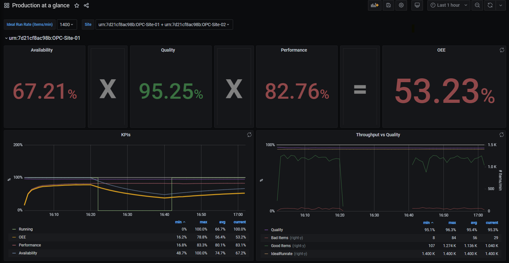

# Flux Query Reference
## Site Level Performance

### OEE
```flux
import "math"
import "csv"

StatusValuesForOn = [101,105,108]

fGetLastStatus = () => {
dummyRecordCsv = "#datatype,string,long,dateTime:RFC3339,dateTime:RFC3339,dateTime:RFC3339,double,string,string,string\n#group,false,false,true,true,false,false,true,true,true\n#default,_result,,,,,,,,\n,result,table,_start,_stop,_time,_value,Source,_field,_measurement\n,,0,2030-01-01T00:00:00.0Z,2030-01-01T00:00:00.0Z,2030-01-01T00:00:00.0Z,0,,STATUS,DeviceData"

dummyRecord=csv.from(csv: dummyRecordCsv )

firstStatusTimestampTemp=
  from(bucket: "telemetry")
  |> range([[range]])
  |> filter(fn: (r) => r._measurement == "DeviceData" )
  |> filter(fn: (r) => r.Source       == "[[Source]]" )
  |> filter(fn: (r) => r._field       == "STATUS" )
  |> first()

firstStatusTimestamp=
     union(tables: [firstStatusTimestampTemp,dummyRecord])
  |> tableFind(fn: (key) => key._field == "STATUS"  )
  |> getColumn(column: "_time")

lastStatusBeforeRangeTemp=
from(bucket: "telemetry")
  |> range(start:-1000d, 
           stop: time(v:uint(v:firstStatusTimestamp[0])-uint(v:1)))
  |> filter(fn: (r) => r._measurement == "DeviceData" )
  |> filter(fn: (r) => r.Source       == "[[Source]]" )
  |> map(fn: (r) => ({
        _field: "STATUS",
        _time: r._time, 
        _value: float(v: contains(value: int(v: r._value),
                                  set  : StatusValuesForOn ))
      }))
  |> last()

lastStatusBeforeRange=
     union(tables: [lastStatusBeforeRangeTemp,dummyRecord])
  |> tableFind(fn: (key) => key._field == "STATUS"  )
  |> getColumn(column: "_value")         

return lastStatusBeforeRange[length(arr:lastStatusBeforeRange)-1]
}

DeviceData=from(bucket: "telemetry")
  |> range([[range]])
  |> filter(fn: (r) => r._measurement == "DeviceData" )
  |> filter(fn: (r) => r.Source       == "[[Source]]" )
  |> group()
  |> keep(columns: ["_time","_field","_value"])

ItemCountGoodData=
  DeviceData
  |> filter(fn: (r) => r._field == "ITEM_COUNT_GOOD" )
  |> aggregateWindow(every: 1m, fn: sum)
  |> sum()
  |> map(fn: (r) => ({
     _value: r._value,
     _time: now()
    }))

ItemCountBadData=
  DeviceData
  |> filter(fn: (r) => r._field == "ITEM_COUNT_BAD" )
  |> aggregateWindow(every: 1m, fn: sum)
  |> sum()
  |> map(fn: (r) => ({
     _value: r._value,
     _time: now()
    }))

StatusData=
  DeviceData
  |> filter(fn: (r) =>  r._field == "STATUS")
  |> map(fn: (r) => ({
      _time: r._time, 
      _value: float(v: contains(value: int(v: r._value), 
                                       set: StatusValuesForOn ))
  }))

StatusDataWindowed=
  StatusData
  |> aggregateWindow(every: 1m, fn: mean)
  |> fill(column: "_value", usePrevious: true) 
  |> fill(column: "_value", value: fGetLastStatus()) 
  |> map(fn: (r) => ({_time: r._time, _value: math.ceil(x: r._value)}))
  
RunningMins=
  StatusDataWindowed
  |> sum()
  |> map(fn: (r) => ({
     _value: r._value,
     _time: now()
    }))

IdleMins=
  StatusDataWindowed
  |> map(fn: (r) => ({
     _value: 1.0 - r._value,
     _time: r._time,
    }))
  |> sum()
  |> map(fn: (r) => ({
     _value: r._value,
     _time: now()
    }))

Availability=
  join(
    tables: {on: RunningMins, off: IdleMins},
    on: ["_time"]
  )
  |> map(fn: (r) => ({
     _value: if r._value_on+r._value_off == 0.0 then 0.0 
             else r._value_on/(r._value_on+r._value_off),
     _time: r._time,
     _field: "Availability"
    }))
    
Quality=
  join(
    tables: {good: ItemCountGoodData, bad: ItemCountBadData},
    on: ["_time"]
  )
  |> map(fn: (r) => ({
     _value: if r._value_good+r._value_bad == 0.0 then 0.0 
             else r._value_good/(r._value_good+r._value_bad),
     _time: r._time,
     _field: "Quality"
    }))

Performance=
  join(
    tables: {good: ItemCountGoodData, on: RunningMins},
    on: ["_time"]
  )
  |> map(fn: (r) => ({
     _value: if r._value_on == 0.0 or float(v:$idealRunrate) == 0.0 then 0.0 
             else (r._value_good/r._value_on)/float(v:$idealRunrate),
     _time: r._time,
     _value_on : r._value_on, _value_good: r._value_good,
     _field: "Performance"
    }))

AxQ=
  join(
    tables: {a:Availability, q: Quality},
    on: ["_time"]
  )
  |> map(fn: (r) => ({
     _value: r._value_a * r._value_q,
     _time: r._time,
     _field: "AxQ"
    }))

OEE=
  join(
    tables: {axq:AxQ, p: Performance},
    on: ["_time"]
  )
  |> map(fn: (r) => ({
     _value: r._value_axq * r._value_p,
     _time: r._time,
     _field: "OEE"
    }))
  |> yield(name: "OEE")
```
### OEE History
```flux
import "math"
import "csv"

StatusValuesForOn = [101,105,108]

fGetLastStatus = () => {
dummyRecordCsv = "#datatype,string,long,dateTime:RFC3339,dateTime:RFC3339,dateTime:RFC3339,double,string,string,string\n#group,false,false,true,true,false,false,true,true,true\n#default,_result,,,,,,,,\n,result,table,_start,_stop,_time,_value,Source,_field,_measurement\n,,0,2030-01-01T00:00:00.0Z,2030-01-01T00:00:00.0Z,2030-01-01T00:00:00.0Z,0,,STATUS,DeviceData"

dummyRecord=csv.from(csv: dummyRecordCsv )

firstStatusTimestampTemp=
  from(bucket: "telemetry")
  |> range([[range]])
  |> filter(fn: (r) => r._measurement == "DeviceData" )
  |> filter(fn: (r) => r.Source       == "[[Source]]" )
  |> filter(fn: (r) => r._field       == "STATUS" )
  |> first()

firstStatusTimestamp=
     union(tables: [firstStatusTimestampTemp,dummyRecord])
  |> tableFind(fn: (key) => key._field == "STATUS"  )
  |> getColumn(column: "_time")

lastStatusBeforeRangeTemp=
from(bucket: "telemetry")
  |> range(start:-1000d, 
           stop: time(v:uint(v:firstStatusTimestamp[0])-uint(v:1)))
  |> filter(fn: (r) => r._measurement == "DeviceData" )
  |> filter(fn: (r) => r.Source       == "[[Source]]" )
  |> map(fn: (r) => ({
        _field: "STATUS",
        _time: r._time, 
        _value: float(v: contains(value: int(v: r._value),
                                  set  : StatusValuesForOn ))
      }))
  |> last()

lastStatusBeforeRange=
     union(tables: [lastStatusBeforeRangeTemp,dummyRecord])
  |> tableFind(fn: (key) => key._field == "STATUS"  )
  |> getColumn(column: "_value")         

return lastStatusBeforeRange[length(arr:lastStatusBeforeRange)-1]
}

DeviceData=from(bucket: "telemetry")
  |> range([[range]])
  |> filter(fn: (r) => r._measurement == "DeviceData" )
  |> filter(fn: (r) => r.Source       == "[[Source]]" )
  |> group()
  |> keep(columns: ["_time","_field","_value"])

ItemCountGoodData=
  DeviceData
  |> filter(fn: (r) => r._field == "ITEM_COUNT_GOOD" )
  |> aggregateWindow(every: 1m, fn: sum)
  |> cumulativeSum()

ItemCountBadData=
  DeviceData
  |> filter(fn: (r) => r._field == "ITEM_COUNT_BAD" )
  |> aggregateWindow(every: 1m, fn: sum)
  |> cumulativeSum()

StatusData=
  DeviceData
  |> filter(fn: (r) =>  r._field == "STATUS")
  |> map(fn: (r) => ({
      _time: r._time, 
      _value: float(v: contains(value: int(v: r._value), 
                                       set: StatusValuesForOn ))
  }))

StatusDataWindowed=
  StatusData
  |> aggregateWindow(every: 1m, fn: mean)
  |> fill(column: "_value", usePrevious: true) 
  |> fill(column: "_value", value: fGetLastStatus()) 
  |> map(fn: (r) => ({_time: r._time, _value: math.ceil(x: r._value)}))
  
RunningMins=
  StatusDataWindowed
  |> cumulativeSum()

IdleMins=
  StatusDataWindowed
  |> map(fn: (r) => ({
     _value: 1.0 - r._value,
     _time: r._time,
    }))
  |> cumulativeSum()

Availability=
  join(
    tables: {on: RunningMins, off: IdleMins},
    on: ["_time"]
  )
  |> map(fn: (r) => ({
     _value: if r._value_on+r._value_off == 0.0 then 0.0 
             else r._value_on/(r._value_on+r._value_off),
     _time: r._time,
     _field: "Availability"
    }))
    
Quality=
  join(
    tables: {good: ItemCountGoodData, bad: ItemCountBadData},
    on: ["_time"]
  )
  |> map(fn: (r) => ({
     _value: if r._value_good+r._value_bad == 0.0 then 0.0 
             else r._value_good/(r._value_good+r._value_bad),
     _time: r._time,
     _field: "Quality"
    }))

Performance=
  join(
    tables: {good: ItemCountGoodData, on: RunningMins},
    on: ["_time"]
  )
  |> map(fn: (r) => ({
     _value: if r._value_on == 0.0 or float(v:$idealRunrate) == 0.0 then 0.0 
             else (r._value_good/r._value_on)/float(v:$idealRunrate),
     _time: r._time,
     _value_on : r._value_on, _value_good: r._value_good,
     _field: "Performance"
    }))

AxQ=
  join(
    tables: {a:Availability, q: Quality},
    on: ["_time"]
  )
  |> map(fn: (r) => ({
     _value: r._value_a * r._value_q,
     _time: r._time,
     _field: "AxQ"
    }))

OEE=
  join(
    tables: {axq:AxQ, p: Performance},
    on: ["_time"]
  )
  |> map(fn: (r) => ({
     _value: r._value_axq * r._value_p,
     _time: r._time,
     _field: "OEE"
    }))
  |> yield(name: "OEE")
```
### Availability
```flux
import "math"
import "csv"

StatusValuesForOn = [101,105,108]

fGetLastStatus = () => {
dummyRecordCsv = "#datatype,string,long,dateTime:RFC3339,dateTime:RFC3339,dateTime:RFC3339,double,string,string,string\n#group,false,false,true,true,false,false,true,true,true\n#default,_result,,,,,,,,\n,result,table,_start,_stop,_time,_value,Source,_field,_measurement\n,,0,2030-01-01T00:00:00.0Z,2030-01-01T00:00:00.0Z,2030-01-01T00:00:00.0Z,0,,STATUS,DeviceData"

dummyRecord=csv.from(csv: dummyRecordCsv )

firstStatusTimestampTemp=
  from(bucket: "telemetry")
  |> range([[range]])
  |> filter(fn: (r) => r._measurement == "DeviceData" )
  |> filter(fn: (r) => r.Source       == "[[Source]]" )
  |> filter(fn: (r) => r._field       == "STATUS" )
  |> first()

firstStatusTimestamp=
     union(tables: [firstStatusTimestampTemp,dummyRecord])
  |> tableFind(fn: (key) => key._field == "STATUS"  )
  |> getColumn(column: "_time")

lastStatusBeforeRangeTemp=
from(bucket: "telemetry")
  |> range(start:-1000d, 
           stop: time(v:uint(v:firstStatusTimestamp[0])-uint(v:1)))
  |> filter(fn: (r) => r._measurement == "DeviceData" )
  |> filter(fn: (r) => r.Source       == "[[Source]]" )
  |> map(fn: (r) => ({
        _field: "STATUS",
        _time: r._time, 
        _value: float(v: contains(value: int(v: r._value),
                                  set  : StatusValuesForOn ))
      }))
  |> last()

lastStatusBeforeRange=
     union(tables: [lastStatusBeforeRangeTemp,dummyRecord])
  |> tableFind(fn: (key) => key._field == "STATUS"  )
  |> getColumn(column: "_value")         

return lastStatusBeforeRange[length(arr:lastStatusBeforeRange)-1]
}

DeviceData=from(bucket: "telemetry")
  |> range([[range]])
  |> filter(fn: (r) => r._measurement == "DeviceData" )
  |> filter(fn: (r) => r.Source       == "[[Source]]" )

 
StatusData=
  DeviceData
  |> filter(fn: (r) =>  r._field == "STATUS")
  |> map(fn: (r) => ({
      _time: r._time, 
      _value: float(v: contains(value: int(v: r._value), 
                                       set: StatusValuesForOn ))
  }))


StatusDataWindowed=
  StatusData
  |> aggregateWindow(every: 1m, fn: mean)
  |> fill(column: "_value", usePrevious: true) 
  |> fill(column: "_value", value: fGetLastStatus()) 
  |> map(fn: (r) => ({_time: r._time, _value: math.ceil(x: r._value)}))
  
RunningMins=
  StatusDataWindowed
  |> sum()
  |> map(fn: (r) => ({
     _value: r._value,
     _time: now()
    }))

  
IdleMins=
  StatusDataWindowed
  |> map(fn: (r) => ({
     _value: 1.0 - r._value,
     _time: r._time,
    }))
  |> sum()
  |> map(fn: (r) => ({
     _value: r._value,
     _time: now()
    }))


Availability=
  join(
    tables: {on: RunningMins, off: IdleMins},
    on: ["_time"]
  )
  |> map(fn: (r) => ({
     _value: if r._value_on+r._value_off == 0.0 then 0.0 
             else r._value_on/(r._value_on+r._value_off),
     _time: r._time,
     _field: "Availability"
    }))
  |> yield(name: "Availability")
```
### Availability History
```flux
import "math"
import "csv"

StatusValuesForOn = [101,105,108]

fGetLastStatus = () => {
dummyRecordCsv = "#datatype,string,long,dateTime:RFC3339,dateTime:RFC3339,dateTime:RFC3339,double,string,string,string\n#group,false,false,true,true,false,false,true,true,true\n#default,_result,,,,,,,,\n,result,table,_start,_stop,_time,_value,Source,_field,_measurement\n,,0,2030-01-01T00:00:00.0Z,2030-01-01T00:00:00.0Z,2030-01-01T00:00:00.0Z,0,,STATUS,DeviceData"

dummyRecord=csv.from(csv: dummyRecordCsv )

firstStatusTimestampTemp=
  from(bucket: "telemetry")
  |> range([[range]])
  |> filter(fn: (r) => r._measurement == "DeviceData" )
  |> filter(fn: (r) => r.Source       == "[[Source]]" )
  |> filter(fn: (r) => r._field       == "STATUS" )
  |> first()

firstStatusTimestamp=
     union(tables: [firstStatusTimestampTemp,dummyRecord])
  |> tableFind(fn: (key) => key._field == "STATUS"  )
  |> getColumn(column: "_time")

lastStatusBeforeRangeTemp=
from(bucket: "telemetry")
  |> range(start:-1000d, 
           stop: time(v:uint(v:firstStatusTimestamp[0])-uint(v:1)))
  |> filter(fn: (r) => r._measurement == "DeviceData" )
  |> filter(fn: (r) => r.Source       == "[[Source]]" )
  |> map(fn: (r) => ({
        _field: "STATUS",
        _time: r._time, 
        _value: float(v: contains(value: int(v: r._value),
                                  set  : StatusValuesForOn ))
      }))
  |> last()

lastStatusBeforeRange=
     union(tables: [lastStatusBeforeRangeTemp,dummyRecord])
  |> tableFind(fn: (key) => key._field == "STATUS"  )
  |> getColumn(column: "_value")         

return lastStatusBeforeRange[length(arr:lastStatusBeforeRange)-1]
}


DeviceData=from(bucket: "telemetry")
  |> range([[range]])
  |> filter(fn: (r) => r._measurement == "DeviceData" )
  |> filter(fn: (r) => r.Source       == "[[Source]]" )
 
StatusData=
  DeviceData
  |> filter(fn: (r) =>  r._field == "STATUS")
  |> map(fn: (r) => ({
      _time: r._time, 
      _value: float(v: contains(value: int(v: r._value), 
                                       set: StatusValuesForOn ))
  }))

StatusDataWindowed=
  StatusData
  |> aggregateWindow(every: 1m, fn: mean)
  |> fill(column: "_value", usePrevious: true) 
  |> fill(column: "_value", value: fGetLastStatus()) 
  |> map(fn: (r) => ({_time: r._time, _value: math.ceil(x: r._value)}))
  
RunningMins=
  StatusDataWindowed
  |> cumulativeSum()
  
IdleMins=
  StatusDataWindowed
  |> map(fn: (r) => ({
     _value: 1.0 - r._value,
     _time: r._time,
    }))
  |> cumulativeSum()

Availability=
  join(
    tables: {on: RunningMins, off: IdleMins},
    on: ["_time"]
  )
  |> map(fn: (r) => ({
     _value: if r._value_on+r._value_off == 0.0 then 0.0 
             else r._value_on/(r._value_on+r._value_off),
     _time: r._time,
     _field: "Availability"
    }))
  |> yield(name: "Availability")


RunStatus=
  StatusDataWindowed
  |> map(fn: (r) => ({
     _value: r._value,
     _time: r._time,
     _field: "Running"
    }))
  |> aggregateWindow(every: 1m, fn: max)
  |> yield(name: "Run Status")
```
### Quality
```flux
DeviceData=from(bucket: "telemetry")
  |> range([[range]])
  |> filter(fn: (r) => r._measurement == "DeviceData" )
  |> filter(fn: (r) => r.Source       == "[[Source]]" )
  |> keep(columns: ["_time","_field","_value"])
 
ItemCountGoodData=
  DeviceData
  |> filter(fn: (r) => r._field == "ITEM_COUNT_GOOD" )
  |> aggregateWindow(every: 1m, fn: sum)
  |> sum()
  |> map(fn: (r) => ({
     _value: r._value,
     _time: now()
    }))

ItemCountBadData=
  DeviceData
  |> filter(fn: (r) => r._field == "ITEM_COUNT_BAD" )
  |> aggregateWindow(every: 1m, fn: sum)
  |> sum()
  |> map(fn: (r) => ({
     _value: r._value,
     _time: now()
    }))

Quality=
  join(
    tables: {good: ItemCountGoodData, bad: ItemCountBadData},
    on: ["_time"]
  )
  |> map(fn: (r) => ({
     _value: if r._value_good+r._value_bad == 0.0 then 0.0 
             else r._value_good/(r._value_good+r._value_bad),
     _time: r._time,
     _field: "Quality"
    }))
  |> yield(name: "Quality")
```
### Quality History
```flux
DeviceData=from(bucket: "telemetry")
  |> range([[range]])
  |> filter(fn: (r) => r._measurement == "DeviceData" )
  |> filter(fn: (r) => r.Source       == "[[Source]]" )
  |> keep(columns: ["_time","_field","_value"])
 
ItemCountGoodDataWindowed=
  DeviceData
  |> filter(fn: (r) => r._field == "ITEM_COUNT_GOOD" )
  |> map(fn: (r) => ({r with _field: "Good Items"}))
  |> aggregateWindow(every: 1m, fn: sum)
  |> yield(name: "Good Items")

ItemCountGoodDataCumulative=
  ItemCountGoodDataWindowed
  |> cumulativeSum()

ItemCountBadDataWindowed=
  DeviceData
  |> filter(fn: (r) => r._field == "ITEM_COUNT_BAD" )
  |> map(fn: (r) => ({r with _field: "Bad Items"}))
  |> aggregateWindow(every: 1m, fn: sum)
  |> yield(name: "Bad Items")

ItemCountBadDataCumulative=
  ItemCountBadDataWindowed
  |> cumulativeSum()

Quality=
  join(
    tables: {good: ItemCountGoodDataCumulative, bad: ItemCountBadDataCumulative},
    on: ["_time"]
  )
  |> map(fn: (r) => ({
     _value: if r._value_good+r._value_bad == 0.0 then 0.0 
             else r._value_good/(r._value_good+r._value_bad),
     _time: r._time,
     _field: "Quality"
    }))
  |> yield(name: "Quality")

IdealRunrate=
  DeviceData
  |> filter(fn: (r) =>
    r._field == "STATUS"
  )
  |> aggregateWindow(every: 1m, fn: sum)
  |> map(fn: (r) => ({
     _value: float(v:$idealRunrate),
     _time: r._time,
     _field: "IdealRunrate"
    }))
  |> yield(name: "IdealRunrate")
```
### Performance
```flux
import "math"
import "csv"

StatusValuesForOn = [101,105,108]

fGetLastStatus = () => {
dummyRecordCsv = "#datatype,string,long,dateTime:RFC3339,dateTime:RFC3339,dateTime:RFC3339,double,string,string,string\n#group,false,false,true,true,false,false,true,true,true\n#default,_result,,,,,,,,\n,result,table,_start,_stop,_time,_value,Source,_field,_measurement\n,,0,2030-01-01T00:00:00.0Z,2030-01-01T00:00:00.0Z,2030-01-01T00:00:00.0Z,0,,STATUS,DeviceData"

dummyRecord=csv.from(csv: dummyRecordCsv )

firstStatusTimestampTemp=
  from(bucket: "telemetry")
  |> range([[range]])
  |> filter(fn: (r) => r._measurement == "DeviceData" )
  |> filter(fn: (r) => r.Source       == "[[Source]]" )
  |> filter(fn: (r) => r._field       == "STATUS" )
  |> first()

firstStatusTimestamp=
     union(tables: [firstStatusTimestampTemp,dummyRecord])
  |> tableFind(fn: (key) => key._field == "STATUS"  )
  |> getColumn(column: "_time")

lastStatusBeforeRangeTemp=
from(bucket: "telemetry")
  |> range(start:-1000d, 
           stop: time(v:uint(v:firstStatusTimestamp[0])-uint(v:1)))
  |> filter(fn: (r) => r._measurement == "DeviceData" )
  |> filter(fn: (r) => r.Source       == "[[Source]]" )
  |> map(fn: (r) => ({
        _field: "STATUS",
        _time: r._time, 
        _value: float(v: contains(value: int(v: r._value),
                                  set  : StatusValuesForOn ))
      }))
  |> last()

lastStatusBeforeRange=
     union(tables: [lastStatusBeforeRangeTemp,dummyRecord])
  |> tableFind(fn: (key) => key._field == "STATUS"  )
  |> getColumn(column: "_value")         

return lastStatusBeforeRange[length(arr:lastStatusBeforeRange)-1]
}

DeviceData=from(bucket: "telemetry")
  |> range([[range]])
  |> filter(fn: (r) => r._measurement == "DeviceData" )
  |> filter(fn: (r) => r.Source       == "[[Source]]" )
  |> group()
  |> keep(columns: ["_time","_field","_value"])

ItemCountGoodData=
  DeviceData
  |> filter(fn: (r) => r._field == "ITEM_COUNT_GOOD" )
  |> aggregateWindow(every: 1m, fn: sum)
  |> sum()
  |> map(fn: (r) => ({
     _value: r._value,
     _time: now()
    }))

StatusData=
  DeviceData
  |> filter(fn: (r) =>  r._field == "STATUS")
  |> map(fn: (r) => ({
      _time: r._time, 
      _value: float(v: contains(value: int(v: r._value), 
                                       set: StatusValuesForOn ))
  }))

StatusDataWindowed=
  StatusData
  |> aggregateWindow(every: 1m, fn: mean)
  |> fill(column: "_value", usePrevious: true) 
  |> fill(column: "_value", value: fGetLastStatus()) 
  |> map(fn: (r) => ({_time: r._time, _value: math.ceil(x: r._value)}))
  
RunningMins=
  StatusDataWindowed
  |> sum()
  |> map(fn: (r) => ({
     _value: r._value,
     _time: now()
    }))

Performance=
  join(
    tables: {good: ItemCountGoodData, on: RunningMins},
    on: ["_time"]
  )
  |> map(fn: (r) => ({
     _value: if r._value_on == 0.0 or float(v:$idealRunrate) == 0.0 then 0.0 
             else (r._value_good/r._value_on)/float(v:$idealRunrate),
     _time: r._time,
     _value_on : r._value_on, _value_good: r._value_good,
     _field: "Performance"
    }))
  |> yield(name: "Performance")
```
### Performance History
```flux
import "math"
import "csv"

StatusValuesForOn = [101,105,108]

fGetLastStatus = () => {
dummyRecordCsv = "#datatype,string,long,dateTime:RFC3339,dateTime:RFC3339,dateTime:RFC3339,double,string,string,string\n#group,false,false,true,true,false,false,true,true,true\n#default,_result,,,,,,,,\n,result,table,_start,_stop,_time,_value,Source,_field,_measurement\n,,0,2030-01-01T00:00:00.0Z,2030-01-01T00:00:00.0Z,2030-01-01T00:00:00.0Z,0,,STATUS,DeviceData"

dummyRecord=csv.from(csv: dummyRecordCsv )

firstStatusTimestampTemp=
  from(bucket: "telemetry")
  |> range([[range]])
  |> filter(fn: (r) => r._measurement == "DeviceData" )
  |> filter(fn: (r) => r.Source       == "[[Source]]" )
  |> filter(fn: (r) => r._field       == "STATUS" )
  |> first()

firstStatusTimestamp=
     union(tables: [firstStatusTimestampTemp,dummyRecord])
  |> tableFind(fn: (key) => key._field == "STATUS"  )
  |> getColumn(column: "_time")

lastStatusBeforeRangeTemp=
from(bucket: "telemetry")
  |> range(start:-1000d, 
           stop: time(v:uint(v:firstStatusTimestamp[0])-uint(v:1)))
  |> filter(fn: (r) => r._measurement == "DeviceData" )
  |> filter(fn: (r) => r.Source       == "[[Source]]" )
  |> map(fn: (r) => ({
        _field: "STATUS",
        _time: r._time, 
        _value: float(v: contains(value: int(v: r._value),
                                  set  : StatusValuesForOn ))
      }))
  |> last()

lastStatusBeforeRange=
     union(tables: [lastStatusBeforeRangeTemp,dummyRecord])
  |> tableFind(fn: (key) => key._field == "STATUS"  )
  |> getColumn(column: "_value")         

return lastStatusBeforeRange[length(arr:lastStatusBeforeRange)-1]
}

DeviceData=from(bucket: "telemetry")
  |> range([[range]])
  |> filter(fn: (r) => r._measurement == "DeviceData" )
  |> filter(fn: (r) => r.Source       == "[[Source]]" )
  |> group()
  |> keep(columns: ["_time","_field","_value"])

ItemCountGoodData=
  DeviceData
  |> filter(fn: (r) => r._field == "ITEM_COUNT_GOOD" )
  |> aggregateWindow(every: 1m, fn: sum)
  |> cumulativeSum()

StatusData=
  DeviceData
  |> filter(fn: (r) =>  r._field == "STATUS")
  |> map(fn: (r) => ({
      _time: r._time, 
      _value: float(v: contains(value: int(v: r._value), 
                                       set: StatusValuesForOn ))
  }))

StatusDataWindowed=
  StatusData
  |> aggregateWindow(every: 1m, fn: mean)
  |> fill(column: "_value", usePrevious: true) 
  |> fill(column: "_value", value: fGetLastStatus()) 
  |> map(fn: (r) => ({_time: r._time, _value: math.ceil(x: r._value)}))
  
RunningMins=
  StatusDataWindowed
  |> cumulativeSum()

Performance=
  join(
    tables: {good: ItemCountGoodData, on: RunningMins},
    on: ["_time"]
  )
  |> map(fn: (r) => ({
     _value: if r._value_on == 0.0 or float(v:$idealRunrate) == 0.0 then 0.0 
             else (r._value_good/r._value_on)/float(v:$idealRunrate),
     _time: r._time,
     _value_on : r._value_on, _value_good: r._value_good,
     _field: "Performance"
    }))
|> yield(name: "Performance")

IdealRunrate=
  DeviceData
  |> filter(fn: (r) =>
    r._field == "STATUS"
  )
  |> aggregateWindow(every: 1m, fn: sum)
  |> map(fn: (r) => ({
     _value: float(v:$idealRunrate),
     _time: r._time,
     _field: "IdealRunrate"
    }))
  |> yield(name: "IdealRunrate")
```

## Asset Benchmarking

### Availability
```flux
import "math"
import "csv"

StatusValuesForOn = [101,105,108]

fGetLastStatus = () => {
dummyRecordCsv = "#datatype,string,long,dateTime:RFC3339,dateTime:RFC3339,dateTime:RFC3339,double,string,string,string\n#group,false,false,true,true,false,false,true,true,true\n#default,_result,,,,,,,,\n,result,table,_start,_stop,_time,_value,Source,_field,_measurement\n,,0,2030-01-01T00:00:00.0Z,2030-01-01T00:00:00.0Z,2030-01-01T00:00:00.0Z,0,,STATUS,DeviceData"

dummyRecord=csv.from(csv: dummyRecordCsv )

firstStatusTimestampTemp=
  from(bucket: "telemetry")
  |> range([[range]])
  |> filter(fn: (r) => r._measurement == "DeviceData" )
  |> filter(fn: (r) => r.Source       == "[[Source]]" )
  |> filter(fn: (r) => r._field       == "STATUS" )
  |> first()

firstStatusTimestamp=
     union(tables: [firstStatusTimestampTemp,dummyRecord])
  |> tableFind(fn: (key) => key._field == "STATUS"  )
  |> getColumn(column: "_time")

lastStatusBeforeRangeTemp=
from(bucket: "telemetry")
  |> range(start:-1000d, 
           stop: time(v:uint(v:firstStatusTimestamp[0])-uint(v:1)))
  |> filter(fn: (r) => r._measurement == "DeviceData" )
  |> filter(fn: (r) => r.Source       == "[[Source]]" )
  |> map(fn: (r) => ({
        _field: "STATUS",
        _time: r._time, 
        _value: float(v: contains(value: int(v: r._value),
                                  set  : StatusValuesForOn ))
      }))
  |> last()

lastStatusBeforeRange=
     union(tables: [lastStatusBeforeRangeTemp,dummyRecord])
  |> tableFind(fn: (key) => key._field == "STATUS"  )
  |> getColumn(column: "_value")         

return lastStatusBeforeRange[length(arr:lastStatusBeforeRange)-1]
}

DeviceData=from(bucket: "telemetry")
  |> range([[range]])
  |> filter(fn: (r) => r._measurement == "DeviceData" )
  |> filter(fn: (r) => r.Source       == "[[Source]]" )

 
StatusData=
  DeviceData
  |> filter(fn: (r) =>  r._field == "STATUS")
  |> map(fn: (r) => ({
      _time: r._time, 
      _value: float(v: contains(value: int(v: r._value), 
                                       set: StatusValuesForOn ))
  }))


StatusDataWindowed=
  StatusData
  |> aggregateWindow(every: 1m, fn: mean)
  |> fill(column: "_value", usePrevious: true) 
  |> fill(column: "_value", value: fGetLastStatus()) 
  |> map(fn: (r) => ({_time: r._time, _value: math.ceil(x: r._value)}))
  
RunningMins=
  StatusDataWindowed
  |> sum()
  |> map(fn: (r) => ({
     _value: r._value,
     _time: now()
    }))

  
IdleMins=
  StatusDataWindowed
  |> map(fn: (r) => ({
     _value: 1.0 - r._value,
     _time: r._time,
    }))
  |> sum()
  |> map(fn: (r) => ({
     _value: r._value,
     _time: now()
    }))


Availability=
  join(
    tables: {on: RunningMins, off: IdleMins},
    on: ["_time"]
  )
  |> map(fn: (r) => ({
     _value: if r._value_on+r._value_off == 0.0 then 0.0 
             else r._value_on/(r._value_on+r._value_off),
     _time: r._time,
     _field: "Availability"
    }))
  |> yield(name: "Availability")
```


### Quality
```flux
DeviceData=from(bucket: "telemetry")
  |> range([[range]])
  |> filter(fn: (r) => r._measurement == "DeviceData" )
  |> filter(fn: (r) => r.Source       == "[[Source]]" )
  |> keep(columns: ["_time","_field","_value"])
 
ItemCountGoodData=
  DeviceData
  |> filter(fn: (r) => r._field == "ITEM_COUNT_GOOD" )
  |> aggregateWindow(every: 1m, fn: sum)
  |> sum()
  |> map(fn: (r) => ({
     _value: r._value,
     _time: now()
    }))

ItemCountBadData=
  DeviceData
  |> filter(fn: (r) => r._field == "ITEM_COUNT_BAD" )
  |> aggregateWindow(every: 1m, fn: sum)
  |> sum()
  |> map(fn: (r) => ({
     _value: r._value,
     _time: now()
    }))

Quality=
  join(
    tables: {good: ItemCountGoodData, bad: ItemCountBadData},
    on: ["_time"]
  )
  |> map(fn: (r) => ({
     _value: if r._value_good+r._value_bad == 0.0 then 0.0 
             else r._value_good/(r._value_good+r._value_bad),
     _time: r._time,
     _field: "Quality"
    }))
  |> yield(name: "Quality")
```
### Performance
```flux
import "math"
import "csv"

StatusValuesForOn = [101,105,108]

fGetLastStatus = () => {
dummyRecordCsv = "#datatype,string,long,dateTime:RFC3339,dateTime:RFC3339,dateTime:RFC3339,double,string,string,string\n#group,false,false,true,true,false,false,true,true,true\n#default,_result,,,,,,,,\n,result,table,_start,_stop,_time,_value,Source,_field,_measurement\n,,0,2030-01-01T00:00:00.0Z,2030-01-01T00:00:00.0Z,2030-01-01T00:00:00.0Z,0,,STATUS,DeviceData"

dummyRecord=csv.from(csv: dummyRecordCsv )

firstStatusTimestampTemp=
  from(bucket: "telemetry")
  |> range([[range]])
  |> filter(fn: (r) => r._measurement == "DeviceData" )
  |> filter(fn: (r) => r.Source       == "[[Source]]" )
  |> filter(fn: (r) => r._field       == "STATUS" )
  |> first()

firstStatusTimestamp=
     union(tables: [firstStatusTimestampTemp,dummyRecord])
  |> tableFind(fn: (key) => key._field == "STATUS"  )
  |> getColumn(column: "_time")

lastStatusBeforeRangeTemp=
from(bucket: "telemetry")
  |> range(start:-1000d, 
           stop: time(v:uint(v:firstStatusTimestamp[0])-uint(v:1)))
  |> filter(fn: (r) => r._measurement == "DeviceData" )
  |> filter(fn: (r) => r.Source       == "[[Source]]" )
  |> map(fn: (r) => ({
        _field: "STATUS",
        _time: r._time, 
        _value: float(v: contains(value: int(v: r._value),
                                  set  : StatusValuesForOn ))
      }))
  |> last()

lastStatusBeforeRange=
     union(tables: [lastStatusBeforeRangeTemp,dummyRecord])
  |> tableFind(fn: (key) => key._field == "STATUS"  )
  |> getColumn(column: "_value")         

return lastStatusBeforeRange[length(arr:lastStatusBeforeRange)-1]
}

DeviceData=from(bucket: "telemetry")
  |> range([[range]])
  |> filter(fn: (r) => r._measurement == "DeviceData" )
  |> filter(fn: (r) => r.Source       == "[[Source]]" )
  |> group()
  |> keep(columns: ["_time","_field","_value"])

ItemCountGoodData=
  DeviceData
  |> filter(fn: (r) => r._field == "ITEM_COUNT_GOOD" )
  |> aggregateWindow(every: 1m, fn: sum)
  |> sum()
  |> map(fn: (r) => ({
     _value: r._value,
     _time: now()
    }))

StatusData=
  DeviceData
  |> filter(fn: (r) =>  r._field == "STATUS")
  |> map(fn: (r) => ({
      _time: r._time, 
      _value: float(v: contains(value: int(v: r._value), 
                                       set: StatusValuesForOn ))
  }))

StatusDataWindowed=
  StatusData
  |> aggregateWindow(every: 1m, fn: mean)
  |> fill(column: "_value", usePrevious: true) 
  |> fill(column: "_value", value: fGetLastStatus()) 
  |> map(fn: (r) => ({_time: r._time, _value: math.ceil(x: r._value)}))
  
RunningMins=
  StatusDataWindowed
  |> sum()
  |> map(fn: (r) => ({
     _value: r._value,
     _time: now()
    }))

Performance=
  join(
    tables: {good: ItemCountGoodData, on: RunningMins},
    on: ["_time"]
  )
  |> map(fn: (r) => ({
     _value: if r._value_on == 0.0 or float(v:$idealRunrate) == 0.0 then 0.0 
             else (r._value_good/r._value_on)/float(v:$idealRunrate),
     _time: r._time,
     _value_on : r._value_on, _value_good: r._value_good,
     _field: "Performance"
    }))
  |> yield(name: "Performance")
```
### OEE
```flux
import "math"
import "csv"

StatusValuesForOn = [101,105,108]

fGetLastStatus = () => {
dummyRecordCsv = "#datatype,string,long,dateTime:RFC3339,dateTime:RFC3339,dateTime:RFC3339,double,string,string,string\n#group,false,false,true,true,false,false,true,true,true\n#default,_result,,,,,,,,\n,result,table,_start,_stop,_time,_value,Source,_field,_measurement\n,,0,2030-01-01T00:00:00.0Z,2030-01-01T00:00:00.0Z,2030-01-01T00:00:00.0Z,0,,STATUS,DeviceData"

dummyRecord=csv.from(csv: dummyRecordCsv )

firstStatusTimestampTemp=
  from(bucket: "telemetry")
  |> range([[range]])
  |> filter(fn: (r) => r._measurement == "DeviceData" )
  |> filter(fn: (r) => r.Source       == "[[Source]]" )
  |> filter(fn: (r) => r._field       == "STATUS" )
  |> first()

firstStatusTimestamp=
     union(tables: [firstStatusTimestampTemp,dummyRecord])
  |> tableFind(fn: (key) => key._field == "STATUS"  )
  |> getColumn(column: "_time")

lastStatusBeforeRangeTemp=
from(bucket: "telemetry")
  |> range(start:-1000d, 
           stop: time(v:uint(v:firstStatusTimestamp[0])-uint(v:1)))
  |> filter(fn: (r) => r._measurement == "DeviceData" )
  |> filter(fn: (r) => r.Source       == "[[Source]]" )
  |> map(fn: (r) => ({
        _field: "STATUS",
        _time: r._time, 
        _value: float(v: contains(value: int(v: r._value),
                                  set  : StatusValuesForOn ))
      }))
  |> last()

lastStatusBeforeRange=
     union(tables: [lastStatusBeforeRangeTemp,dummyRecord])
  |> tableFind(fn: (key) => key._field == "STATUS"  )
  |> getColumn(column: "_value")         

return lastStatusBeforeRange[length(arr:lastStatusBeforeRange)-1]
}

DeviceData=from(bucket: "telemetry")
  |> range([[range]])
  |> filter(fn: (r) => r._measurement == "DeviceData" )
  |> filter(fn: (r) => r.Source       == "[[Source]]" )
  |> group()
  |> keep(columns: ["_time","_field","_value"])

ItemCountGoodData=
  DeviceData
  |> filter(fn: (r) => r._field == "ITEM_COUNT_GOOD" )
  |> aggregateWindow(every: 1m, fn: sum)
  |> sum()
  |> map(fn: (r) => ({
     _value: r._value,
     _time: now()
    }))

ItemCountBadData=
  DeviceData
  |> filter(fn: (r) => r._field == "ITEM_COUNT_BAD" )
  |> aggregateWindow(every: 1m, fn: sum)
  |> sum()
  |> map(fn: (r) => ({
     _value: r._value,
     _time: now()
    }))

StatusData=
  DeviceData
  |> filter(fn: (r) =>  r._field == "STATUS")
  |> map(fn: (r) => ({
      _time: r._time, 
      _value: float(v: contains(value: int(v: r._value), 
                                       set: StatusValuesForOn ))
  }))

StatusDataWindowed=
  StatusData
  |> aggregateWindow(every: 1m, fn: mean)
  |> fill(column: "_value", usePrevious: true) 
  |> fill(column: "_value", value: fGetLastStatus()) 
  |> map(fn: (r) => ({_time: r._time, _value: math.ceil(x: r._value)}))
  
RunningMins=
  StatusDataWindowed
  |> sum()
  |> map(fn: (r) => ({
     _value: r._value,
     _time: now()
    }))

IdleMins=
  StatusDataWindowed
  |> map(fn: (r) => ({
     _value: 1.0 - r._value,
     _time: r._time,
    }))
  |> sum()
  |> map(fn: (r) => ({
     _value: r._value,
     _time: now()
    }))

Availability=
  join(
    tables: {on: RunningMins, off: IdleMins},
    on: ["_time"]
  )
  |> map(fn: (r) => ({
     _value: if r._value_on+r._value_off == 0.0 then 0.0 
             else r._value_on/(r._value_on+r._value_off),
     _time: r._time,
     _field: "Availability"
    }))
    
Quality=
  join(
    tables: {good: ItemCountGoodData, bad: ItemCountBadData},
    on: ["_time"]
  )
  |> map(fn: (r) => ({
     _value: if r._value_good+r._value_bad == 0.0 then 0.0 
             else r._value_good/(r._value_good+r._value_bad),
     _time: r._time,
     _field: "Quality"
    }))

Performance=
  join(
    tables: {good: ItemCountGoodData, on: RunningMins},
    on: ["_time"]
  )
  |> map(fn: (r) => ({
     _value: if r._value_on == 0.0 or float(v:$idealRunrate) == 0.0 then 0.0 
             else (r._value_good/r._value_on)/float(v:$idealRunrate),
     _time: r._time,
     _value_on : r._value_on, _value_good: r._value_good,
     _field: "Performance"
    }))

AxQ=
  join(
    tables: {a:Availability, q: Quality},
    on: ["_time"]
  )
  |> map(fn: (r) => ({
     _value: r._value_a * r._value_q,
     _time: r._time,
     _field: "AxQ"
    }))

OEE=
  join(
    tables: {axq:AxQ, p: Performance},
    on: ["_time"]
  )
  |> map(fn: (r) => ({
     _value: r._value_axq * r._value_p,
     _time: r._time,
     _field: "OEE"
    }))
  |> yield(name: "OEE")
```


## Production At A Glance

### Availability
```flux
import "math"
import "csv"

StatusValuesForOn = [101,105,108]

fGetLastStatus = () => {
dummyRecordCsv = "#datatype,string,long,dateTime:RFC3339,dateTime:RFC3339,dateTime:RFC3339,double,string,string,string\n#group,false,false,true,true,false,false,true,true,true\n#default,_result,,,,,,,,\n,result,table,_start,_stop,_time,_value,Source,_field,_measurement\n,,0,2030-01-01T00:00:00.0Z,2030-01-01T00:00:00.0Z,2030-01-01T00:00:00.0Z,0,,STATUS,DeviceData"

dummyRecord=csv.from(csv: dummyRecordCsv )

firstStatusTimestampTemp=
  from(bucket: "telemetry")
  |> range([[range]])
  |> filter(fn: (r) => r._measurement == "DeviceData" )
  |> filter(fn: (r) => r.Source       == "[[Source]]" )
  |> filter(fn: (r) => r._field       == "STATUS" )
  |> first()

firstStatusTimestamp=
     union(tables: [firstStatusTimestampTemp,dummyRecord])
  |> tableFind(fn: (key) => key._field == "STATUS"  )
  |> getColumn(column: "_time")

lastStatusBeforeRangeTemp=
from(bucket: "telemetry")
  |> range(start:-1000d, 
           stop: time(v:uint(v:firstStatusTimestamp[0])-uint(v:1)))
  |> filter(fn: (r) => r._measurement == "DeviceData" )
  |> filter(fn: (r) => r.Source       == "[[Source]]" )
  |> map(fn: (r) => ({
        _field: "STATUS",
        _time: r._time, 
        _value: float(v: contains(value: int(v: r._value),
                                  set  : StatusValuesForOn ))
      }))
  |> last()

lastStatusBeforeRange=
     union(tables: [lastStatusBeforeRangeTemp,dummyRecord])
  |> tableFind(fn: (key) => key._field == "STATUS"  )
  |> getColumn(column: "_value")         

return lastStatusBeforeRange[length(arr:lastStatusBeforeRange)-1]
}

DeviceData=from(bucket: "telemetry")
  |> range([[range]])
  |> filter(fn: (r) => r._measurement == "DeviceData" )
  |> filter(fn: (r) => r.Source       == "[[Source]]" )
 
StatusData=
  DeviceData
  |> filter(fn: (r) =>  r._field == "STATUS")
  |> map(fn: (r) => ({
      _time: r._time, 
      _value: float(v: contains(value: int(v: r._value), 
                                       set: StatusValuesForOn ))
  }))

StatusDataWindowed=
  StatusData
  |> aggregateWindow(every: 1m, fn: mean)
  |> fill(column: "_value", usePrevious: true) 
  |> fill(column: "_value", value: fGetLastStatus()) 
  |> map(fn: (r) => ({_time: r._time, _value: math.ceil(x: r._value)}))
  
RunningMins=
  StatusDataWindowed
  |> sum()
  |> map(fn: (r) => ({
     _value: r._value,
     _time: now()
    }))
  
IdleMins=
  StatusDataWindowed
  |> map(fn: (r) => ({
     _value: 1.0 - r._value,
     _time: r._time,
    }))
  |> sum()
  |> map(fn: (r) => ({
     _value: r._value,
     _time: now()
    }))

Availability=
  join(
    tables: {on: RunningMins, off: IdleMins},
    on: ["_time"]
  )
  |> map(fn: (r) => ({
     _value: if r._value_on+r._value_off == 0.0 then 0.0 
             else r._value_on/(r._value_on+r._value_off),
     _time: r._time,
     _field: "Availability"
    }))
  |> yield(name: "Availability")
```


### Quality
```flux
DeviceData=from(bucket: "telemetry")
  |> range([[range]])
  |> filter(fn: (r) => r._measurement == "DeviceData" )
  |> filter(fn: (r) => r.Source       == "[[Source]]" )
  |> keep(columns: ["_time","_field","_value"])
 
ItemCountGoodData=
  DeviceData
  |> filter(fn: (r) => r._field == "ITEM_COUNT_GOOD" )
  |> aggregateWindow(every: 1m, fn: sum)
  |> sum()
  |> map(fn: (r) => ({
     _value: r._value,
     _time: now()
    }))

ItemCountBadData=
  DeviceData
  |> filter(fn: (r) => r._field == "ITEM_COUNT_BAD" )
  |> aggregateWindow(every: 1m, fn: sum)
  |> sum()
  |> map(fn: (r) => ({
     _value: r._value,
     _time: now()
    }))

Quality=
  join(
    tables: {good: ItemCountGoodData, bad: ItemCountBadData},
    on: ["_time"]
  )
  |> map(fn: (r) => ({
     _value: if r._value_good+r._value_bad == 0.0 then 0.0 
             else r._value_good/(r._value_good+r._value_bad),
     _time: r._time,
     _field: "Quality"
    }))
  |> yield(name: "Quality")
```
### Performance
```flux
import "math"
import "csv"

StatusValuesForOn = [101,105,108]

fGetLastStatus = () => {
dummyRecordCsv = "#datatype,string,long,dateTime:RFC3339,dateTime:RFC3339,dateTime:RFC3339,double,string,string,string\n#group,false,false,true,true,false,false,true,true,true\n#default,_result,,,,,,,,\n,result,table,_start,_stop,_time,_value,Source,_field,_measurement\n,,0,2030-01-01T00:00:00.0Z,2030-01-01T00:00:00.0Z,2030-01-01T00:00:00.0Z,0,,STATUS,DeviceData"

dummyRecord=csv.from(csv: dummyRecordCsv )

firstStatusTimestampTemp=
  from(bucket: "telemetry")
  |> range([[range]])
  |> filter(fn: (r) => r._measurement == "DeviceData" )
  |> filter(fn: (r) => r.Source       == "[[Source]]" )
  |> filter(fn: (r) => r._field       == "STATUS" )
  |> first()

firstStatusTimestamp=
     union(tables: [firstStatusTimestampTemp,dummyRecord])
  |> tableFind(fn: (key) => key._field == "STATUS"  )
  |> getColumn(column: "_time")

lastStatusBeforeRangeTemp=
from(bucket: "telemetry")
  |> range(start:-1000d, 
           stop: time(v:uint(v:firstStatusTimestamp[0])-uint(v:1)))
  |> filter(fn: (r) => r._measurement == "DeviceData" )
  |> filter(fn: (r) => r.Source       == "[[Source]]" )
  |> map(fn: (r) => ({
        _field: "STATUS",
        _time: r._time, 
        _value: float(v: contains(value: int(v: r._value),
                                  set  : StatusValuesForOn ))
      }))
  |> last()

lastStatusBeforeRange=
     union(tables: [lastStatusBeforeRangeTemp,dummyRecord])
  |> tableFind(fn: (key) => key._field == "STATUS"  )
  |> getColumn(column: "_value")         

return lastStatusBeforeRange[length(arr:lastStatusBeforeRange)-1]
}

DeviceData=from(bucket: "telemetry")
  |> range([[range]])
  |> filter(fn: (r) => r._measurement == "DeviceData" )
  |> filter(fn: (r) => r.Source       == "[[Source]]" )
  |> group()
  |> keep(columns: ["_time","_field","_value"])

ItemCountGoodData=
  DeviceData
  |> filter(fn: (r) => r._field == "ITEM_COUNT_GOOD" )
  |> aggregateWindow(every: 1m, fn: sum)
  |> sum()
  |> map(fn: (r) => ({
     _value: r._value,
     _time: now()
    }))

StatusData=
  DeviceData
  |> filter(fn: (r) =>  r._field == "STATUS")
  |> map(fn: (r) => ({
      _time: r._time, 
      _value: float(v: contains(value: int(v: r._value), 
                                       set: StatusValuesForOn ))
  }))

StatusDataWindowed=
  StatusData
  |> aggregateWindow(every: 1m, fn: mean)
  |> fill(column: "_value", usePrevious: true) 
  |> fill(column: "_value", value: fGetLastStatus()) 
  |> map(fn: (r) => ({_time: r._time, _value: math.ceil(x: r._value)}))
  
RunningMins=
  StatusDataWindowed
  |> sum()
  |> map(fn: (r) => ({
     _value: r._value,
     _time: now()
    }))

Performance=
  join(
    tables: {good: ItemCountGoodData, on: RunningMins},
    on: ["_time"]
  )
  |> map(fn: (r) => ({
     _value: if r._value_on == 0.0 or float(v:$idealRunrate) == 0.0 then 0.0 
             else (r._value_good/r._value_on)/float(v:$idealRunrate),
     _time: r._time,
     _value_on : r._value_on, _value_good: r._value_good,
     _field: "Performance"
    }))
  |> yield(name: "Performance")
```
### OEE
```flux
import "math"
import "csv"

StatusValuesForOn = [101,105,108]

fGetLastStatus = () => {
dummyRecordCsv = "#datatype,string,long,dateTime:RFC3339,dateTime:RFC3339,dateTime:RFC3339,double,string,string,string\n#group,false,false,true,true,false,false,true,true,true\n#default,_result,,,,,,,,\n,result,table,_start,_stop,_time,_value,Source,_field,_measurement\n,,0,2030-01-01T00:00:00.0Z,2030-01-01T00:00:00.0Z,2030-01-01T00:00:00.0Z,0,,STATUS,DeviceData"

dummyRecord=csv.from(csv: dummyRecordCsv )

firstStatusTimestampTemp=
  from(bucket: "telemetry")
  |> range([[range]])
  |> filter(fn: (r) => r._measurement == "DeviceData" )
  |> filter(fn: (r) => r.Source       == "[[Source]]" )
  |> filter(fn: (r) => r._field       == "STATUS" )
  |> first()

firstStatusTimestamp=
     union(tables: [firstStatusTimestampTemp,dummyRecord])
  |> tableFind(fn: (key) => key._field == "STATUS"  )
  |> getColumn(column: "_time")

lastStatusBeforeRangeTemp=
from(bucket: "telemetry")
  |> range(start:-1000d, 
           stop: time(v:uint(v:firstStatusTimestamp[0])-uint(v:1)))
  |> filter(fn: (r) => r._measurement == "DeviceData" )
  |> filter(fn: (r) => r.Source       == "[[Source]]" )
  |> map(fn: (r) => ({
        _field: "STATUS",
        _time: r._time, 
        _value: float(v: contains(value: int(v: r._value),
                                  set  : StatusValuesForOn ))
      }))
  |> last()

lastStatusBeforeRange=
     union(tables: [lastStatusBeforeRangeTemp,dummyRecord])
  |> tableFind(fn: (key) => key._field == "STATUS"  )
  |> getColumn(column: "_value")         

return lastStatusBeforeRange[length(arr:lastStatusBeforeRange)-1]
}

DeviceData=from(bucket: "telemetry")
  |> range([[range]])
  |> filter(fn: (r) => r._measurement == "DeviceData" )
  |> filter(fn: (r) => r.Source       == "[[Source]]" )
  |> group()
  |> keep(columns: ["_time","_field","_value"])

ItemCountGoodData=
  DeviceData
  |> filter(fn: (r) => r._field == "ITEM_COUNT_GOOD" )
  |> aggregateWindow(every: 1m, fn: sum)
  |> sum()
  |> map(fn: (r) => ({
     _value: r._value,
     _time: now()
    }))

ItemCountBadData=
  DeviceData
  |> filter(fn: (r) => r._field == "ITEM_COUNT_BAD" )
  |> aggregateWindow(every: 1m, fn: sum)
  |> sum()
  |> map(fn: (r) => ({
     _value: r._value,
     _time: now()
    }))

StatusData=
  DeviceData
  |> filter(fn: (r) =>  r._field == "STATUS")
  |> map(fn: (r) => ({
      _time: r._time, 
      _value: float(v: contains(value: int(v: r._value), 
                                       set: StatusValuesForOn ))
  }))

StatusDataWindowed=
  StatusData
  |> aggregateWindow(every: 1m, fn: mean)
  |> fill(column: "_value", usePrevious: true) 
  |> fill(column: "_value", value: fGetLastStatus()) 
  |> map(fn: (r) => ({_time: r._time, _value: math.ceil(x: r._value)}))
  
RunningMins=
  StatusDataWindowed
  |> sum()
  |> map(fn: (r) => ({
     _value: r._value,
     _time: now()
    }))

IdleMins=
  StatusDataWindowed
  |> map(fn: (r) => ({
     _value: 1.0 - r._value,
     _time: r._time,
    }))
  |> sum()
  |> map(fn: (r) => ({
     _value: r._value,
     _time: now()
    }))

Availability=
  join(
    tables: {on: RunningMins, off: IdleMins},
    on: ["_time"]
  )
  |> map(fn: (r) => ({
     _value: if r._value_on+r._value_off == 0.0 then 0.0 
             else r._value_on/(r._value_on+r._value_off),
     _time: r._time,
     _field: "Availability"
    }))
    
Quality=
  join(
    tables: {good: ItemCountGoodData, bad: ItemCountBadData},
    on: ["_time"]
  )
  |> map(fn: (r) => ({
     _value: if r._value_good+r._value_bad == 0.0 then 0.0 
             else r._value_good/(r._value_good+r._value_bad),
     _time: r._time,
     _field: "Quality"
    }))

Performance=
  join(
    tables: {good: ItemCountGoodData, on: RunningMins},
    on: ["_time"]
  )
  |> map(fn: (r) => ({
     _value: if r._value_on == 0.0 or float(v:$idealRunrate) == 0.0 then 0.0 
             else (r._value_good/r._value_on)/float(v:$idealRunrate),
     _time: r._time,
     _value_on : r._value_on, _value_good: r._value_good,
     _field: "Performance"
    }))

AxQ=
  join(
    tables: {a:Availability, q: Quality},
    on: ["_time"]
  )
  |> map(fn: (r) => ({
     _value: r._value_a * r._value_q,
     _time: r._time,
     _field: "AxQ"
    }))

OEE=
  join(
    tables: {axq:AxQ, p: Performance},
    on: ["_time"]
  )
  |> map(fn: (r) => ({
     _value: r._value_axq * r._value_p,
     _time: r._time,
     _field: "OEE"
    }))
  |> yield(name: "OEE")
```
### KPIs
```flux
import "math"
import "csv"

StatusValuesForOn = [101,105,108]

fGetLastStatus = () => {
dummyRecordCsv = "#datatype,string,long,dateTime:RFC3339,dateTime:RFC3339,dateTime:RFC3339,double,string,string,string\n#group,false,false,true,true,false,false,true,true,true\n#default,_result,,,,,,,,\n,result,table,_start,_stop,_time,_value,Source,_field,_measurement\n,,0,2030-01-01T00:00:00.0Z,2030-01-01T00:00:00.0Z,2030-01-01T00:00:00.0Z,0,,STATUS,DeviceData"

dummyRecord=csv.from(csv: dummyRecordCsv )

firstStatusTimestampTemp=
  from(bucket: "telemetry")
  |> range([[range]])
  |> filter(fn: (r) => r._measurement == "DeviceData" )
  |> filter(fn: (r) => r.Source       == "[[Source]]" )
  |> filter(fn: (r) => r._field       == "STATUS" )
  |> first()

firstStatusTimestamp=
     union(tables: [firstStatusTimestampTemp,dummyRecord])
  |> tableFind(fn: (key) => key._field == "STATUS"  )
  |> getColumn(column: "_time")

lastStatusBeforeRangeTemp=
from(bucket: "telemetry")
  |> range(start:-1000d, 
           stop: time(v:uint(v:firstStatusTimestamp[0])-uint(v:1)))
  |> filter(fn: (r) => r._measurement == "DeviceData" )
  |> filter(fn: (r) => r.Source       == "[[Source]]" )
  |> map(fn: (r) => ({
        _field: "STATUS",
        _time: r._time, 
        _value: float(v: contains(value: int(v: r._value),
                                  set  : StatusValuesForOn ))
      }))
  |> last()

lastStatusBeforeRange=
     union(tables: [lastStatusBeforeRangeTemp,dummyRecord])
  |> tableFind(fn: (key) => key._field == "STATUS"  )
  |> getColumn(column: "_value")         

return lastStatusBeforeRange[length(arr:lastStatusBeforeRange)-1]
}

DeviceData=from(bucket: "telemetry")
  |> range([[range]])
  |> filter(fn: (r) => r._measurement == "DeviceData" )
  |> filter(fn: (r) => r.Source       == "[[Source]]" )
  |> group()
  |> keep(columns: ["_time","_field","_value"])

ItemCountGoodData=
  DeviceData
  |> filter(fn: (r) => r._field == "ITEM_COUNT_GOOD" )
  |> aggregateWindow(every: 1m, fn: sum)
  |> map(fn: (r) => ({r with _field: "Good Items"}))
  |> cumulativeSum()

ItemCountBadData=
  DeviceData
  |> filter(fn: (r) => r._field == "ITEM_COUNT_BAD" )
  |> aggregateWindow(every: 1m, fn: sum)
  |> map(fn: (r) => ({r with _field: "Bad Items"}))
  |> cumulativeSum()

StatusData=
  DeviceData
  |> filter(fn: (r) =>  r._field == "STATUS")
  |> map(fn: (r) => ({
      _time: r._time, 
      _value: float(v: contains(value: int(v: r._value), 
                                       set: StatusValuesForOn ))
  }))

StatusDataWindowed=
  StatusData
  |> aggregateWindow(every: 1m, fn: mean)
  |> fill(column: "_value", usePrevious: true) 
  |> fill(column: "_value", value: fGetLastStatus()) 
  |> map(fn: (r) => ({_time: r._time, _value: math.ceil(x: r._value)}))
  
RunningMins=
  StatusDataWindowed
  |> cumulativeSum()

IdleMins=
  StatusDataWindowed
  |> map(fn: (r) => ({
     _value: 1.0 - r._value,
     _time: r._time,
    }))
  |> cumulativeSum()

Availability=
  join(
    tables: {on: RunningMins, off: IdleMins},
    on: ["_time"]
  )
  |> map(fn: (r) => ({
     _value: if r._value_on+r._value_off == 0.0 then 0.0 
             else r._value_on/(r._value_on+r._value_off),
     _time: r._time,
     _field: "Availability"
    }))
  
Quality=
  join(
    tables: {good: ItemCountGoodData, bad: ItemCountBadData},
    on: ["_time"]
  )
  |> map(fn: (r) => ({
     _value: if r._value_good+r._value_bad == 0.0 then 0.0 
             else r._value_good/(r._value_good+r._value_bad),
     _time: r._time,
     _field: "Quality"
    }))

Performance=
  join(
    tables: {good: ItemCountGoodData, on: RunningMins},
    on: ["_time"]
  )
  |> map(fn: (r) => ({
     _value: if r._value_on == 0.0 or float(v:$idealRunrate) == 0.0 then 0.0 
             else (r._value_good/r._value_on)/float(v:$idealRunrate),
     _time: r._time,
     _value_on : r._value_on, _value_good: r._value_good,
     _field: "Performance"
    }))

AxQ=
  join(
    tables: {a:Availability, q: Quality},
    on: ["_time"]
  )
  |> map(fn: (r) => ({
     _value: r._value_a * r._value_q,
     _time: r._time,
     _field: "AxQ"
    }))

OEE=
  join(
    tables: {axq:AxQ, p: Performance},
    on: ["_time"]
  )
  |> map(fn: (r) => ({
     _value: r._value_axq * r._value_p,
     _time: r._time,
     _field: "OEE"
    }))

OEE
|>yield(name: "OEE")

Availability
|>yield(name: "Availability")

Quality
|>yield(name: "Quality")

Performance
|>yield(name: "Performance")

RunStatus=
StatusDataWindowed
|> map(fn: (r) => ({
    _value: r._value,
    _time: r._time,
    _field: "Running"
}))
|> aggregateWindow(every: 1m, fn: max)
|> yield(name: "Run Status") 
```

### Throughput vs Quality
```flux
DeviceData=from(bucket: "telemetry")
  |> range([[range]])
  |> filter(fn: (r) => r._measurement == "DeviceData" )
  |> filter(fn: (r) => r.Source       == "[[Source]]" )
  |> group()
  |> keep(columns: ["_time","_field","_value"])

ItemCountGoodData=
  DeviceData
  |> filter(fn: (r) => r._field == "ITEM_COUNT_GOOD" )
  |> aggregateWindow(every: 1m, fn: sum)
  |> map(fn: (r) => ({r with _field: "Good Items"}))
  |> yield(name: "Good Items")
  |> cumulativeSum()

ItemCountBadData=
  DeviceData
  |> filter(fn: (r) => r._field == "ITEM_COUNT_BAD" )
  |> aggregateWindow(every: 1m, fn: sum)
  |> map(fn: (r) => ({r with _field: "Bad Items"}))
  |> yield(name: "Bad Items")
  |> cumulativeSum()

Quality=
  join(
    tables: {good: ItemCountGoodData, bad: ItemCountBadData},
    on: ["_time"]
  )
  |> map(fn: (r) => ({
     _value: if r._value_good+r._value_bad == 0.0 then 0.0 
             else r._value_good/(r._value_good+r._value_bad),
     _time: r._time,
     _field: "Quality"
    }))

Quality
|>yield(name: "Quality")

IdealRunrate=
  DeviceData
  |> filter(fn: (r) =>
    r._field == "STATUS"
  )
  |> aggregateWindow(every: 1m, fn: sum)
  |> map(fn: (r) => ({
     _value: float(v:$idealRunrate),
     _time: r._time,
     _field: "IdealRunrate"
    }))
  |> yield(name: "IdealRunrate")
 
  ```

## Table Schema
*Note that measurement DeviceData is automatically created on first insert.*


```iql
CREATE DATABASE telemetry
CREATE RETENTION POLICY rp1day ON telemetry DURATION 1d REPLICATION 1 DEFAULT
```

```iql
> show measurements
name: measurements
name
----
DeviceData

> show tag keys
name: DeviceData
tagKey
------
Source

> show field keys
name: DeviceData
fieldKey        fieldType
--------        ---------
ITEM_COUNT_BAD  float
ITEM_COUNT_GOOD float
STATUS          float
```
