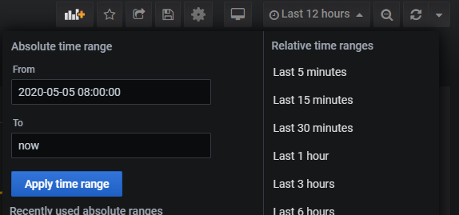

# IoT Offline Dashboarding sample OEE drilldown

As discussed in the [readme](/readme.md) this sample is based around a dashboard to display machine performance KPIs in a manufacturing environment. In particular, the sample includes the necessary data collection, calculations, and visualization of the Overall Equipment Effectiveness (OEE) metric, common to manufacturers.

For more information on the chosen scenario as well as alternative options, please see [the sample documentation](dashboarding-sample.md)

**Table of contents**
* [KPI types](#kpi-types)
* [Sample data sources and data flow](#sample-data-sources-and-data-flow)
* [Site Level Performance dashboard](#site-level-performance-dashboard)

## KPI types

### Performance

The performance KPI indicates whether or not a machine is working as intended & achieving it's desired output. It is calculated as:

```html
Performance = (Good Items Produced/Total Time Machine was Running)/(Ideal Rate of Production)
```

"Ideal Rate of Production" is the expected rate of production and is provided as a parameter. The unit of the performance KPI is percentage (%) and "Ideal Rate of Production" is provided as a parameter to dashboards.

### Quality

Quality is the ratio of items produced by the machine that pass quality checks over all items produced, assuming that there will be items that fail the quality bar. It is calculated as:

```html
Quality = (Good Items Produced)/(Good Items Produced + Bad Items Produced)
```

The unit for the Quality KPI is a percentage (%)

### Availability

Availability is defined as percentage of time the machine was available. Normally, this does not include any planned downtime, however for the sake of simplicity we assume that the sample factory operates 24x7.

The calculation is as follows:

```html
Availability = (Running Time)/(Running Time + Idle Time)
```

The unit for Availability KPI is a percentage (%)

### Operational Equipment Effectiveness (OEE)

Finally, OEE is a higher level KPI that is calculated from the other KPIs above and depicts the overall equipment efficiency of within the manufacturing process:

```html
OEE = Availability x Quality x Performance
```

The unit for the OEE KPI is a percentage (%)

## Sample data sources and data flow

The flow of data within the sample is depicted by green arrows in the following diagram.


* Two simulators act as OPC servers
* OPC Publisher subscribes to three data points in OPC Servers
* Data collected by the OPC Publisher is sent to the cloud (through the Edge Hub module) AND in parallel is routed to the offline dashboards Node-RED module for processing.
* Node-RED module unifies the data format and writes the data into InfluxDB
* Grafana dashboards reads the data from InfluxDB and displays dashboards to operators and users.
* OPC Publisher, Node-RED module, InfluxDB and Grafana are all deployed as separate containers through the IOT Edge runtime.
* For sake of simplicity, two OPC simulators are also deployed as Node-RED modules in a container through the IoT Edge runtime.

### OPC Simulator

This sample solution uses an [OPC simulator](https://flows.nodered.org/node/node-red-contrib-opcua) to simulate a data flow coming from machines in a manufacturing environment.

OPC Simulator is a flow implemented in Node-Red. Two simulators are used to simulate two different OPC servers connected to the same IoT Edge device.

| OPC Simulator Flow 1                          | OPC Simulator Flow 2                           |
| --------------------------------------------- | ---------------------------------------------- |
|  |  |

Simulators essentially have the same template, but differentiated by two settings: Product URI and port:

|                      | Product URI | Port  |
| -------------------- | ----------- | ----- |
| OPC Simulator Flow 1 | OPC-Site-01 | 54845 |
| OPC Simulator Flow 2 | OPC-Site-02 | 54855 |

The OPC simulators generate three data points:

#### Data Point: STATUS

STATUS indicates the current status of the device that the OPC server is connected to. STATUS values are randomly generated using following rules:

* Value changes at least in 10 minute intervals
* STATUS value is one of the following: 101,105,108, 102,104,106,107,109
* STATUS values 101, 105, 108 indicate that the machine is running
* STATUS values 102,104,106,107,109 indicate that the machine is not running
* A random number generator ensures that machine will be in RUNNING state (i.e. STATUS 101,105,108) 90% of the time

#### Data Point: ITEM_COUNT_GOOD

ITEM_COUNT_GOOD indicates the number of good items (products that pass quality tests) produced by the machine since the last data point. It is a random integer between 80-120. Simulators generate item counts every 5 seconds. This could be taken in any unit but the sample regards it as "number of items".

#### Data Point: ITEM_COUNT_BAD

ITEM_COUNT_BAD indicates the number of bad items (ITEMS_DISCARDED) produced by the machine since the last data point. It is a random integer between 0-10. Simulators generate item counts every 5 seconds. This could be taken in any unit but the sample regards it as "number of items".

### Data Processing Module (Node-RED)

Data collected from simulators by the OPC publisher module are sent to the Node-RED module for processing. The Node-RED module validates the data, converts it to a suitable format, and writes it to InfluxDB.

During processing, the Application URI value is extracted from JSON data and written to the "Source" tag in the database schema.

### Database (InfluxDB)

All data collected flows into a single measurement (DeviceData) in a single database (telemetry) in InfluxDB. The measurement "DeviceData" has 3 fields and 1 tag:

**Fields:**

* STATUS: float
* ITEM_COUNT_GOOD: float
* ITEM_COUNT_BAD: float

**Tags:**

* Source

Note that STATUS values are preserved as they come from the OPC Server. These values are mapped to determine if the machine is running using InfluxDB queries.

## Site Level Performance dashboard

The Site Level Performance dashboard displays the manufacturing KPIs (OEE, Availability, Quality, Performance) per site.


**Site** is basically defined as the OPC server providing the data and uses OPC Server's Product URI as the site name (Source). See the Node-RED module code for the algorithm used to extract the Product URI from Node Id.

In a production implementations the site name will correspond to a specific equipment or asset.

The sample application defines two different sites, corresponding to the two OPC Simulators.


**Ideal run rate** is the ideal capacity of production for the given equipment. It is used to calculate the Performance KPI. See the definition of the Performance KPI above for the calculation method.


Each row in the dashboard represents a KPI. The gauge on the left-hand side reports the KPI result as per selected time window. In the sample screenshot above, the time window is "Last 12 hours". Therefore the top left gauge for OEE KPI corresponds to a value of 54.23% over the last 12 hours.


In a production environment operators would typically monitor KPIs for their current shift. To do that the operator has to set the period start time in line with their shift and leave the end period as "now()":



Line graphs show indicators at 12:00AM, 08:00AM and 04:00PM to highlight working shift changes in the fictional manufacturing floor.

Following table depicts details of each element in the dashboard:

| Dashboard Element                                            |                     Snapshot                      |
| ------------------------------------------------------------ | :-----------------------------------------------: |
| The OEE gauge shows the Operational Equipment Effectiveness for the selected time period.        |                    |
| OEE graph shows the change across the selected time period. Minimum, Maximum, Average values of OEE across time period are provided in the legend. |                    |
| The availability gauge shows Availability for the time period selected. |  |
| Availability graph shows value changes over the time period selected. Minimum, Maximum, Average values of Availability across time period are provided in the legend. The blue line indicates when a machine was actually running. |  |
| The quality gauge shows Quality for the time period selected. |            |
| Quality graph shows value change over the selected time period on the left axis. It also shows the number of "Good Items" produced (items that are properly manufactured) as a green line - as well as "Bad Items" produced (items that are discarded) asa  red line. Note that the "Good Items" and "Bad Items" are aggregated at the minute level and their unit is "number of items per minute". The "Ideal Run Rate" parameter value, entered manually at the top of dashboard, is shown as a reference aligned to the right axis. Minimum, Maximum, Average values of Quality, Good Items and Bad Items are provided in the legend. |            |
| Performance gauge shows the Performance for the time period selected. |    |
| The performance graph shows the change in Performance for the time period selected. Minimum, Maximum, Average values of Performance across time period are provided in the legend. The "Ideal Run Rate" parameter value, entered manually at the top of dashboard, is shown as a reference line, again, aligned to the right axis. |    |

### Building the "Site Level Performance" dashboard

#### Variables

`$idealRunrate` is defined as a constant value (1400) which indicates the ideal throughput of the equipment/asset. This variable is used to calculate Performance and Quality.

`$Source` is defined as a query from influxdb database which pulls available "Source" tags from "DeviceData" measurement. This is essentially a list of assets we have measurements in the selected time range (`$range`).

```
from(bucket: "telemetry")
  |> range($range)
  |> filter(fn: (r) =>r._measurement == "DeviceData")
  |> keep(columns:["Source"])
  |> distinct(column: "Source")
```

#### Panels

The dashboard contains 8 panels which are built on similar Flux queries of the same data source. The most comprehensive of these queries is used in the "OEE History" since calculating the OEE actually involves processing other KPIs. See [KPI types](#kpi-types) above.


The following section examines the Flux query for the "OEE History" panel in detail.

```
import "math"

import "csv"
```

Define that the STATUS values 101,105 and 108 will be considered as "asset is in RUNNING state".

```
StatusValuesForOn = [101,105,108]
```

The `fGetLastStatus` function finds the last STATUS value in the relevant time range. The simulator changes the STATUS value every 10 minutes, however the OPC Server does not publish it unless the new value is different than the previous one. At any time, STATUS value should be considered as the "last set value".

```
fGetLastStatus = () => {
```

A dummy record is defined to avoid errors from the `tableFind` function later.

```
dummyRecordCsv = "#datatype,string,long,dateTime:RFC3339,dateTime:RFC3339,dateTime:RFC3339,double,string,string,string\n#group,false,false,true,true,false,false,true,true,true\n#default,_result,,,,,,,,\n,result,table,_start,_stop,_time,_value,Source,_field,_measurement\n,,0,2030-01-01T00:00:00.0Z,2030-01-01T00:00:00.0Z,2030-01-01T00:00:00.0Z,0,,STATUS,DeviceData"

dummyRecord=csv.from(csv: dummyRecordCsv )
```

Find the first STATUS value in the currently selected time range and for the selected asset (source).

```
firstStatusTimestampTemp=
  from(bucket: "telemetry")
  |> range([[range]])
  |> filter(fn: (r) => r._measurement == "DeviceData" )
  |> filter(fn: (r) => r.Source       == "[[Source]]" )
  |> filter(fn: (r) => r._field       == "STATUS" )
  |> first()
```

Then union the result with the dummy record so that the result will have at least one table, even if there aren't any STATUS values in the current range.

```
firstStatusTimestamp=
  union(tables: [firstStatusTimestampTemp,dummyRecord])
  |> tableFind(fn: (key) => key._field == "STATUS"  )
  |> getColumn(column: "_time")
```

Search for the last (latest) STATUS value and the first (oldest) STATUS value in selected time range. Note that in later versions of the Grafana connector (7.0+) for Flux, it isn't required to search for the first value in range. 

```
lastStatusBeforeRangeTemp=
from(bucket: "telemetry")
  |> range(start:-1000d, // Flux queries have to have the start of a range, 
                         // make sure start of range is old enough to cover all cases
           stop: time(v:uint(v:firstStatusTimestamp[0])-uint(v:1)))
  |> filter(fn: (r) => r._measurement == "DeviceData" )
  |> filter(fn: (r) => r.Source       == "[[Source]]" )
  |> map(fn: (r) => ({
         _field: "STATUS",
         _time: r._time, 
         _value: float(v: contains(value: int(v: r._value),
                                   set  : StatusValuesForOn ))//If STATUS value is one of StatusValuesForOn
                                                              // then return 1.0f else 0.0f
     }))
  |> last()
```

Again, union the result with a dummy record so that the result will have at least one table.

```
lastStatusBeforeRange=
     union(tables: [lastStatusBeforeRangeTemp,dummyRecord])
  |> tableFind(fn: (key) => key._field == "STATUS"  )
  |> getColumn(column: "_value")
```

The following will return the latest STATUS value (as 1 or 0).

```
return lastStatusBeforeRange[length(arr:lastStatusBeforeRange)-1]
}
```

Filter all fields (aka measurements: ITEM_COUNT_GOOD, ITEM_COUNT_BAD, STATUS) for the selected time range and selected asset source. This will be the base query template.

```
DeviceData=from(bucket: "telemetry")
  |> range([[range]])
  |> filter(fn: (r) => r._measurement == "DeviceData" )
  |> filter(fn: (r) => r.Source       == "[[Source]]" )
  |> group() //remove any grouping
  |> keep(columns: ["_time","_field","_value"])
```

Extract the field ITEM_COUNT_GOOD, adding values in one minute intervals and calculating the cumulative sum.

```
ItemCountGoodData=
  DeviceData
  |> filter(fn: (r) => r._field == "ITEM_COUNT_GOOD" )
  |> aggregateWindow(every: 1m, fn: sum)
  |> cumulativeSum()
```

Extract the field ITEM_COUNT_BAD, adding values in one minute intervals and calculating the cumulative sum.

```
ItemCountBadData=
  DeviceData
  |> filter(fn: (r) => r._field == "ITEM_COUNT_BAD" )
  |> aggregateWindow(every: 1m, fn: sum)
  |> cumulativeSum()
```

Extract the field STATUS, converting the values to 0.0 or 1.0. STATUS values in the set `StatusValuesForOn` (see above) are mapped to 1.0, all other are mapped to 0.0. 

```
StatusData=
  DeviceData
  |> filter(fn: (r) =>  r._field == "STATUS")
  |> map(fn: (r) => ({
        _time: r._time, 
        _value: float(v: contains(value: int(v: r._value), 
                                  set: StatusValuesForOn ))

  }))
```

Extract the field STATUS again, averaging the values in one minute intervals. If the average is > 0 for any 1 minute interval, it is assumed that the asset is running within this interval.

```
StatusDataWindowed=
  StatusData
  |> aggregateWindow(every: 1m, fn: mean)      //calculate STATUS (1 or 0) for each 1 min window
  |> fill(column: "_value", usePrevious: true) // if there are no values in any window, use previous status
  |> fill(column: "_value", value: fGetLastStatus()) //if there's no previous STATUS (i.e number of null
                                                     //records in the beginning of the range), calculate 
                                                     //the last status before range starts
  |> map(fn: (r) => ({_time: r._time, _value: math.ceil(x: r._value)}))
```

Calculate the cumulative sum over STATUS so that each row shows the minutes of uptime (= running) since the start of the range.

```
RunningMins=
  StatusDataWindowed
  |> cumulativeSum()
```

Calculate the cumulative sum over the negated STATUS so that each row shows the sum of idle minutes from the start of the range.

```
IdleMins=
  StatusDataWindowed
  |> map(fn: (r) => ({
      _value: 1.0 - r._value,
      _time: r._time,
     }))
  |> cumulativeSum()
```

The values above represent the base datasets used to calculate the KPIs.

Using `cumulativeSum` with the calculations above allows to calculate [all defined KPIs](#kpi-types) within the time range up to that row.

For Availability the result dataset contains a row for every minute from the start of the range and a _value in every row that represents the respective availability result.

```
Availability=
  join( //join two datasets on _time, each dataset has a row for every minute from the start of range
     tables: {on: RunningMins, off: IdleMins},
     on: ["_time"]
  )
  |> map(fn: (r) => ({
      _value: if r._value_on+r._value_off == 0.0 then 0.0 
              else r._value_on/(r._value_on+r._value_off), //calculate KPI
      _time: r._time,        // set time
      _field: "Availability" //set field/KPI name
     }))
```

The same is true for Quality. 

```
Quality=
  join( //join two datasets on _time, each dataset has a row for every minute from the start of range
     tables: {good: ItemCountGoodData, bad: ItemCountBadData},
     on: ["_time"]
  )
  |> map(fn: (r) => ({
      _value: if r._value_good+r._value_bad == 0.0 then 0.0 
              else r._value_good/(r._value_good+r._value_bad), //calculate KPI
      _time: r._time,   // set time
      _field: "Quality" //set field/KPI name
     }))
```

For Performance `$idealRunrate` represents the assets ideal production capacity.

```
Performance=
  join( //join two datasets on _time, each dataset has a row for every minute from the start of range
    tables: {good: ItemCountGoodData, on: RunningMins},
    on: ["_time"]
  )
  |> map(fn: (r) => ({
     _value: if r._value_on == 0.0 or float(v:$idealRunrate) == 0.0 then 0.0 
             else (r._value_good/r._value_on)/float(v:$idealRunrate), //Calculate KPI
     _time: r._time,  //set time
     _value_on : r._value_on, 
     _value_good: r._value_good,
     _field: "Performance" //set field/KPI name
    }))
```

The OEE is calculated from these base KPIs. Note that all KPIs are defined in a dataset containing the _time and _value.

Since Flux does not support more than 2 table joins, this uses a temporary dataset to join Availability and Quality first.

```
AxQ=
  join(
    tables: {a:Availability, q: Quality},
    on: ["_time"]
  )
  |> map(fn: (r) => ({
     _value: r._value_a * r._value_q,
     _time: r._time,
     _field: "AxQ"
    }))
```

Then join the temporary dataset with Performance to calculate the OEE:

```
OEE=
  join(
    tables: {axq:AxQ, p: Performance},
    on: ["_time"]
  )
  |> map(fn: (r) => ({
     _value: r._value_axq * r._value_p,
     _time: r._time,
     _field: "OEE"
    }))
  |> yield(name: "OEE") // use yield function to materialize dataset
```

The OEE Gauge displays the value from the start to the end of of the selected range. Therefore its Flux query contains `sum()` instead of `cumulativeSum()` as the desired datasets should contain only one record rather than a record for every minute.

Below is the Flux query for the OEE Gauge. The differences in the query are marked with `//****`.

```
import "math"
import "csv"

StatusValuesForOn = [101,105,108]

fGetLastStatus = () => {

dummyRecordCsv = "#datatype,string,long,dateTime:RFC3339,dateTime:RFC3339,dateTime:RFC3339,double,string,string,string\n#group,false,false,true,true,false,false,true,true,true\n#default,_result,,,,,,,,\n,result,table,_start,_stop,_time,_value,Source,_field,_measurement\n,,0,2030-01-01T00:00:00.0Z,2030-01-01T00:00:00.0Z,2030-01-01T00:00:00.0Z,0,,STATUS,DeviceData"

dummyRecord=csv.from(csv: dummyRecordCsv )

firstStatusTimestampTemp=
  from(bucket: "telemetry")
  |> range([[range]])
  |> filter(fn: (r) => r._measurement == "DeviceData" )
  |> filter(fn: (r) => r.Source       == "[[Source]]" )
  |> filter(fn: (r) => r._field       == "STATUS" )
  |> first()

firstStatusTimestamp=
     union(tables: [firstStatusTimestampTemp,dummyRecord])
  |> tableFind(fn: (key) => key._field == "STATUS"  )
  |> getColumn(column: "_time")

lastStatusBeforeRangeTemp=
from(bucket: "telemetry")
  |> range(start:-1000d, 
           stop: time(v:uint(v:firstStatusTimestamp[0])-uint(v:1)))
  |> filter(fn: (r) => r._measurement == "DeviceData" )
  |> filter(fn: (r) => r.Source       == "[[Source]]" )
  |> map(fn: (r) => ({
        _field: "STATUS",
        _time: r._time, 
        _value: float(v: contains(value: int(v: r._value),
                                  set  : StatusValuesForOn ))
      }))
  |> last()

lastStatusBeforeRange=
     union(tables: [lastStatusBeforeRangeTemp,dummyRecord])
  |> tableFind(fn: (key) => key._field == "STATUS"  )
  |> getColumn(column: "_value")         

return lastStatusBeforeRange[length(arr:lastStatusBeforeRange)-1]
}

DeviceData=from(bucket: "telemetry")
  |> range([[range]])
  |> filter(fn: (r) => r._measurement == "DeviceData" )
  |> filter(fn: (r) => r.Source       == "[[Source]]" )
  |> group()
  |> keep(columns: ["_time","_field","_value"])

ItemCountGoodData=
  DeviceData
  |> filter(fn: (r) => r._field == "ITEM_COUNT_GOOD" )
  |> aggregateWindow(every: 1m, fn: sum)
  |> sum()  //****
  |> map(fn: (r) => ({
     _value: r._value,
     _time: now()
    }))

ItemCountBadData=
  DeviceData
  |> filter(fn: (r) => r._field == "ITEM_COUNT_BAD" )
  |> aggregateWindow(every: 1m, fn: sum)
  |> sum()  //****
  |> map(fn: (r) => ({
     _value: r._value,
     _time: now()
    }))

StatusData=
  DeviceData
  |> filter(fn: (r) =>  r._field == "STATUS")
  |> map(fn: (r) => ({
      _time: r._time, 
      _value: float(v: contains(value: int(v: r._value), 
                                       set: StatusValuesForOn ))
  }))

StatusDataWindowed=
  StatusData
  |> aggregateWindow(every: 1m, fn: mean)
  |> fill(column: "_value", usePrevious: true) 
  |> fill(column: "_value", value: fGetLastStatus()) 
  |> map(fn: (r) => ({_time: r._time, _value: math.ceil(x: r._value)}))

RunningMins=
  StatusDataWindowed
  |> sum()  //****
  |> map(fn: (r) => ({
     _value: r._value,
     _time: now()
    }))

IdleMins=
  StatusDataWindowed
  |> map(fn: (r) => ({
     _value: 1.0 - r._value,
     _time: r._time,
    }))
  |> sum()  //****
  |> map(fn: (r) => ({
     _value: r._value,
     _time: now()
    }))

Availability=
  join(
    tables: {on: RunningMins, off: IdleMins},
    on: ["_time"]
  )
  |> map(fn: (r) => ({
     _value: if r._value_on+r._value_off == 0.0 then 0.0 
             else r._value_on/(r._value_on+r._value_off),
     _time: r._time,
     _field: "Availability"
    }))

Quality=
  join(
    tables: {good: ItemCountGoodData, bad: ItemCountBadData},
    on: ["_time"]
  )
  |> map(fn: (r) => ({
     _value: if r._value_good+r._value_bad == 0.0 then 0.0 
             else r._value_good/(r._value_good+r._value_bad),
     _time: r._time,
     _field: "Quality"
    }))

Performance=
  join(
    tables: {good: ItemCountGoodData, on: RunningMins},
    on: ["_time"]
  )
  |> map(fn: (r) => ({
     _value: if r._value_on == 0.0 or float(v:$idealRunrate) == 0.0 then 0.0 
             else (r._value_good/r._value_on)/float(v:$idealRunrate),
     _time: r._time,
     _value_on : r._value_on, _value_good: r._value_good,
     _field: "Performance"
    }))

AxQ=
  join(
    tables: {a:Availability, q: Quality},
    on: ["_time"]
  )
  |> map(fn: (r) => ({
     _value: r._value_a * r._value_q,
     _time: r._time,
     _field: "AxQ"
    }))

OEE=
  join(
    tables: {axq:AxQ, p: Performance},
    on: ["_time"]
  )
  |> map(fn: (r) => ({
     _value: r._value_axq * r._value_p,
     _time: r._time,
     _field: "OEE"
    }))
  |> yield(name: "OEE")
```
