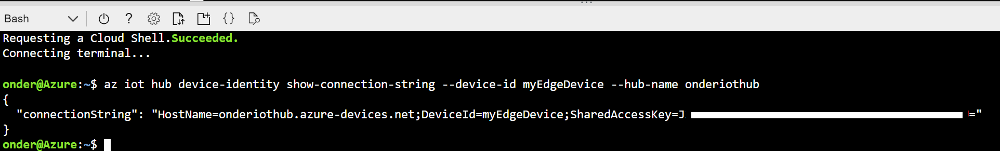

# Creating an Azure environment to develop and run IoT Edge services

This document describes how to set up the required Azure services as well as an AMD64-Linux-based IoT Edge box to deploy the sample.

**Table of contents**
* [Install Azure CLI](#install-azure-cli)
* [Install Azure IoT for deployment](#install-azure-iot-for-deployment)
* [Create the Azure and Edge services needed](#create-the-required-azure-and-edge-services)

## Install Azure CLI

This sample leverages the [Azure Command Line Interface (CLI)](https://docs.microsoft.com/en-us/cli). To install the Azure CLI for your environment, follow the instructions [here](https://docs.microsoft.com/en-us/cli/azure/install-azure-cli?view=azure-cli-latest) for the desired environment. 

Alternately, use the [Azure Cloud Shell](https://docs.microsoft.com/en-us/azure/cloud-shell/quickstart?view=azure-cli-latest) in the Azure Portal, which has the CLI pre-installed. Follow the instructions until the "Create a resource group" section.

## Install Azure-IoT for deployment

The `azure-iot` extension is used to deploy the sample.

Note that the legacy version was called `azure-iot-cli-ext`:

* Use the command `az extension list` to validate the currently installed extensions before you install azure-iot.
* Use `az extension remove --name azure-cli-iot-ext` to remove the legacy version of the extension.

Use `az extension add --name azure-iot` to add the most recent version of the extension.

## Create the required Azure and Edge services

Create a resource group to manage all the resources used in this solution:

```bash
az group create --name {resource_group} --location {datacenter_location}
```

### Create an Azure Container Registry

This sample is based on Docker images for each module, which are pushed to a Docker container registry.

If not already available, set up an Azure Container Registry with these [instructions](https://docs.microsoft.com/en-us/azure/container-registry/container-registry-get-started-azure-cli#create-a-container-registry). Once created navigate to the "Access Keys" blade in the left navigation of the container registry settings and note down the username and password.

### Create an Azure IoT Hub

Create a new IoT Hub resource. Detailed information can be found at: <https://docs.microsoft.com/en-us/azure/iot-edge/quickstart-linux>

```bash
az iot hub create --resource-group {resource_group} --name {hub_name} --sku S1
```

### Create an IoT Edge device identity

A device identity is required for each IoT Edge device so that it can communicate with the IoT Hub. The device identity lives in the cloud, and the device uses a unique device connection string to associate itself to its device identity.

Detailed information can be found at: <https://docs.microsoft.com/en-us/azure/iot-edge/how-to-register-device>

```bash
az iot hub device-identity create --hub-name {hub_name} --device-id myEdgeDevice --edge-enabled
```

Retrieve the connection string for the created device, which links the physical device with its identity in the IoT Hub.

```bash
az iot hub device-identity show-connection-string --device-id myEdgeDevice --hub-name {hub_name}
```

Copy the value of the `connectionString` from the JSON output and save it. The connection string is used to configure the IoT Edge runtime in the next section.



### Create and configure an IoT Edge VM

The sample can be run on a [physical IoT Edge device](https://catalog.azureiotsolutions.com/) or a virtual machine. Microsoft provides a [virtual machine image based on Ubuntu](https://azuremarketplace.microsoft.com/marketplace/apps/microsoft_iot_edge.iot_edge_vm_ubuntu) that has everything preinstalled to run Azure IoT Edge on a device. Accept the terms of use and create the virtual machine using the following command:

```bash
az vm image terms accept --urn microsoft_iot_edge:iot_edge_vm_ubuntu:ubuntu_1604_edgeruntimeonly:latest

az vm create --resource-group {resource_group} --name myEdgeVM --image microsoft_iot_edge:iot_edge_vm_ubuntu:ubuntu_1604_edgeruntimeonly:latest --admin-username azureuser --generate-ssh-keys
```

Use the primary device connection string noted above to connect the IoT Edge device (or VM) to the IoT Hub.

```bash
az vm run-command invoke -g {resource_group} -n myEdgeVM --command-id RunShellScript --script "/etc/iotedge/configedge.sh '{device_connection_string}'"
```

If successful, SSH into your device / VM using the 'azureuser' username and run:

```bash
iotedge list
```

This should list the edgeAgent module running, indicating a successful setup.

## Dashboard solution preparation

The sample is using a persistent storage for the InfluxDB database, which requires a directory for the module to bind to. Use the ssh command to log into the Edge device / VM and run the following commands:

```bash
sudo mkdir /influxdata
sudo chmod 777 -R /influxdata
```

Next, open a port for the Grafana dashboards. The default Grafana port is 3000:

> [!NOTE]
> This is not required in a production environment / using real devices, as any "offline" clients will probably be on the same network as the IoT Edge box. This is only required if using a VM in Azure.

```bash
az vm open-port --resource-group {resource group} --name {edge vm name} --port 3000
```

Depending on the Azure environment it might be required to add a rule to the subnet as well:

```bash
az vm open-port --resource-group {resource group} --name {edge vm name} --apply-to-subnet --port 3000
```

You can now return to the [dashboarding sample](dashboarding-sample.md#deployment-of-the-sample) document to pick a deployment strategy.
