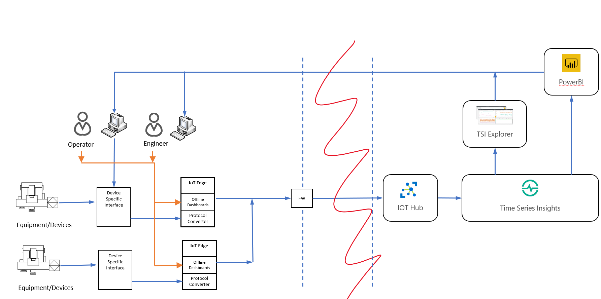
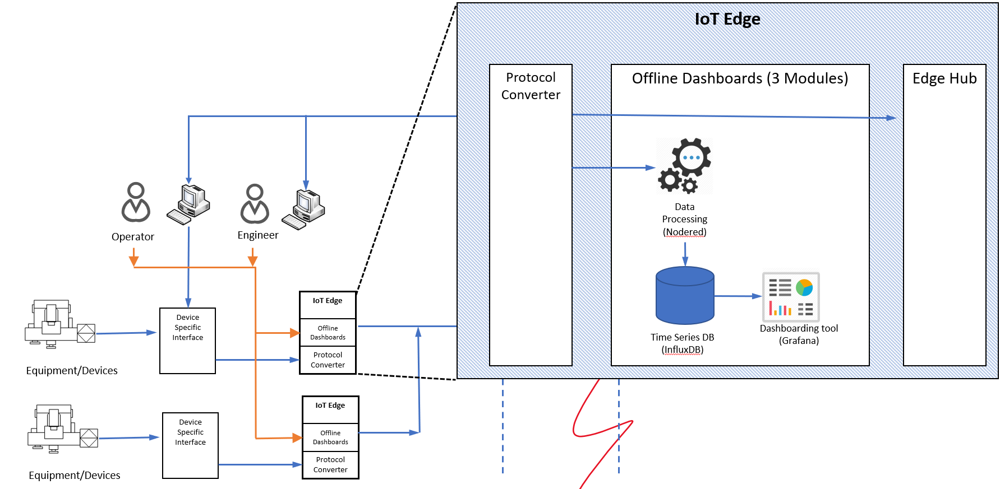

# IoT Edge Offline Dashboarding

This project provides a set of modules that can be used with Azure IoT Edge to perform dashboarding at the edge. 

The goal is to provide both guidance as well as a sample implementation to enable dashboards that run on the edge at sites in the field, while still sending data to the cloud for centralized reporting and monitoring.

If you want to jump right into the sample implementation, please start [here](./documentation/dashboarding-sample.md).

**Table of contents**

* [Engage and contribute](#engage-and-contribute)
* [Solution goals](#solution-goals)
* [Solution architecture & components](#solution-architecture-&-components)
* [Offline Dashboards sample](#offline-dashboards-sample)

## Engage and contribute

* Ask questions about developing for Azure IoT Edge on [Stack Overflow](https://stackoverflow.com/questions/tagged/azure-iot-edge) using the **azure-iot-edge** tag.

* Search for [known issues](https://github.com/AzureIoTGBB/iot-edge-offline-dashboarding/issues) or file a [new issue](https://github.com/AzureIoTGBB/iot-edge-offline-dashboarding/issues/new) if you find something broken in this project.

* Learn how you can contribute to this project [here](./documentation/contributing.md).

* This project has adopted the [Microsoft Open Source Code of Conduct](https://opensource.microsoft.com/codeofconduct/).
For more information, see the [Code of Conduct FAQ](https://opensource.microsoft.com/codeofconduct/faq/) or contact [opencode@microsoft.com](mailto:opencode@microsoft.com) with any additional questions or comments.

## Solution goals

The purpose of this solution is to provide both general purpose guidance for dashboarding on the edge as well as a sample implementation. While our sample implementation focuses on manufacturing, there are plenty of other potential use cases for this technology. Some examples include:

* Retail stores that may need local dashboards for inventory or asset management
* Warehouses that may need to manage the tracking and movement of product throughout the warehouse
* Smart buildings who may need to manage energy or HVAC efficiency throughout the property
* "Things that move" applications such as container or cruise ships that may need to operate for extended periods offline

The main thing in common in these scenarios is the potential need to not only send important 'site' data to the cloud for centralized reporting and analytics, but also the ability to continue local operations in the event of an internet outage.

The goal of this project is to demonstrate how this can be done for a specific manufacturing use case, but also give an example that can be re-used for other use cases by:

* Replacing the data source(s) to be specific to the new use cases
* Replacing the configuration files for the data ingestion and dashboards

## Solution architecture & components

The architecture for this solution utilizes four main components in addition to Azure IoT Hub.

* [Azure IoT Edge](https://docs.microsoft.com/en-us/azure/iot-edge/) is utilized to orchestrate and manage modules at the edge in addition to providing capabilities for offline operation and message routing.
* [Node-RED](https://nodered.org/) is an open-source flow programming tool utilized to easily integrate and route messages from edge devices to InfluxDB. 
* [InfluxDB](https://www.influxdata.com/) is an open-source, time series database for storing device telemetry.
* Lastly, [Grafana](https://grafana.com/) is an open-source analytics and dashboarding tool for visualizing device telemetry.

This architecture and its components are intended to be general purpose and apply across several industries and use cases by simply switching out the data sources and dashboards. However, by far the customer segment where this need comes up the most often is manufacturing. Therefore, the sample implementation below focuses on that use case.

### Reasons for selecting this architecture

The main purpose of this solution is to provide an ability for local operators to view dashboards at the edge regardless of whether the edge device was online or offline. This is a natural scenario that IoT Edge supports. To support dashboarding however, there was a need to also select both a storage component as well as a visualization component. 

#### Storage component

Several storage solutions were reviewed and the team selected InfluxDB for the following reasons:

* Influx DB is a time series DB and as such is a natural fit for telemetry data from devices
* Open-source with a large community following
* Supports plugin to Grafana
* Node-RED libraries for easy integration
* Quick time to value and can be deployed as a Docker container
* Ranked #1 for time series DBs according to [DB-Engines](https://db-engines.com/en/system/InfluxDB)

Although InfluxDB was chosen to support storage, other DBs were considered and could potentially be used as well. For example, [Graphite](http://graphiteapp.org/), [Prometheus](https://prometheus.io) and [Elasticsearch](https://www.elastic.co/de/) were also considered. [Azure Time Series Insights](https://azure.microsoft.com/en-us/services/time-series-insights) was also considered but at the time of this activity was not yet available on Azure IoT Edge.

#### Visualization component

Several visualization solutions were reviewed and the team selected Grafana for the following reasons:

* Open-source with a large community following
* This particular use case covers metric analysis vs log analysis
* Flexibility with support for a wide array of plugins to different DBs and other supporting tools
* Allows you to share dashboards across an organization
* Quick time to value and can be deployed as a Docker container

Although Grafana was chosen to support visualization and dashboarding, other tools were considered and could potentially be used as well. For example, [Kibana](https://www.elastic.co/kibana) may be a better fit for visualization and analyzing of log files and is a natural fit if working with Elasticsearch. [Chronograf](https://www.influxdata.com/time-series-platform/chronograf) was considered but was limited to InfluxDB as a data source. [PowerBI Report Server](https://powerbi.microsoft.com/en-us/report-server/) was also investigated, but lack of support for being able to containerize the PowerBI Report Server meant it could not be used directly with Azure IoT Edge. Additionally, PowerBI Report Server does not support the real-time "live" dashboarding required for this solution.

#### Integration component

Node-RED was chosen as the tool to ease integration between IoT Edge and InfluxDB. Although the integration component could be written in several programming languages and containerized, Node-RED was selected for the following reasons:

* Open-source with a large community following
* Readily available [nodes](https://flows.nodered.org/node/node-red-contrib-azure-iot-edge-kpm) for tapping into IoT Edge message routes
* Readily available [nodes](https://flows.nodered.org/node/node-red-contrib-influxdb) for integrating and inserting data into InfluxDB as well as many other DBs
* Large library of nodes to integrate with other tools and platforms
* Easy flow-based programming allows manipulation and massaging of messages before inserted into a DB.
* Can be deployed as a Docker container

## Offline Dashboards sample

The "Offline Dashboards" sample is built upon [Azure IoT Edge](https://azure.microsoft.com/en-us/services/iot-edge/) technology. Azure IoT Edge is responsible for deploying and managing lifecycle of a set of modules (described later) that make up Offline Dashboards sample.

Offline Dashboards runs on the IoT Edge device, continuously recording data that is sent from devices to IoT Hub. It contains 3 modules:

1. A Node-Red module that collects data from one or more data sources, in our case off of the edgeHub message bus, and writes that data into InfluxDB.
2. An InfluxDB module which stores data in time series structure.
3. A Grafana module which serves data from InfluxDB in dashboards.

The sample implementation leverages data from two OPC-UA servers. For many reasons, [OPC-UA](https://opcfoundation.org/about/opc-technologies/opc-ua/) is Microsoft's recommended manufacturing integration technology, where possible. However, the OPC-UA publisher that generates data for the dashboard could be substituted with other data sources including Modbus, MQTT, or other custom protocols. 

Start learning about the actual sample implementation [here](./documentation/dashboarding-sample.md).
