# IoT Edge Offline Dashboarding

This project provides a set of modules that can be used with Azure IoT Edge in order to perform dashboarding at the edge.  

The goal is to provide both guidance as well as a sample implementation to show how you can enable dashboards that run on the edge at sites in the field, while still sending data to the cloud for centralized reporting and monitoring.

The architecture for this solution is composed of the following components:

* [Azure IoT Edge](https://azure.microsoft.com/en-us/services/iot-edge/)
* [Node-RED](https://nodered.org/)
* [InfluxDB](https://www.influxdata.com/products/influxdb-overview/)
* [Grafana](https://grafana.com/grafana/)

For information on other potential "Dashboarding on the Edge" use cases, why this architecture was chosen, discussion of alternatives, please see [background](/docs/background.md).

This architecture and its components are intended to be general purpose and apply across a number of industries and use cases by simply switching out the data sources and dashboards. However, by far the customer segment where this need comes up the most often is manufacturing. Therefore the sample implementation below focuses on that use case.

## About the sample

This sample implementation leverages data from an OPC-UA device.  For many reasons, OPC-UA is Microsoft's recommended manufacturing integration technology, where possible. However, the OPC-UA publisher that generates data for the dashboard could be substituted with other data sources including modbus, MQTT, or other custom protocols.  

## Business Need

Smart Manufacturing provides new opportunities to improve inefficiencies across labor, processes, machinery, materials and energy across manufacturing lifecycle.

Azure Industrial IoT provides hybrid-cloud based components to build the end to end industrial IoT platform to enable innovation and to optimize operational processes.

Most manufacturers start their journey by providing visibility across machines, processes, lines, factories through their unified industrial IoT platform. This is achieved by collecting data from manufacturing processes to provide end to end visibility.

Different stakeholders will then make use of that platform to cater their own needs e.g planning department doing global planning or engineers monitoring and fine-tuning production phases.

Operators and users that are responsible for monitoring of operations are at the top of industrial IoT stakeholders list. They are usually responsible for well-being of operations and processes and need to have access to information in real-time. On the other hand, we also know that means of communication (infrastructure) is less than perfect in many manufacturing facilities. Although, we can provide real time access in the industrial IoT platform, what would happen if communications to cloud is cut-off? In terms of data reliability, Azure IoT Edge ensures data is accumulated when communications to cloud is broken and sent to the industrial IoT platform when facility is restored. But how can users access real time information in the meanwhile?

There are two major points this sample implementation addresses:

* Give local machine operators the ability to view telemetry and Key Performance Indicators (KPIs) during intermittent or offline internet connection scenarios.
* View near real-time telemetry and KPIs without the latency of telemetry data traveling to the cloud first.

## The Solution

The Offline Dashboards sample is built upon Azure IoT Edge technology. IoT Edge is responsible for deploying and managing lifecycle of a set of modules (described later) that make up Offline Dashboards sample.

Offline Dashboards runs at the IoT Edge device continuously recording data that is sent from devices to IoT Hub

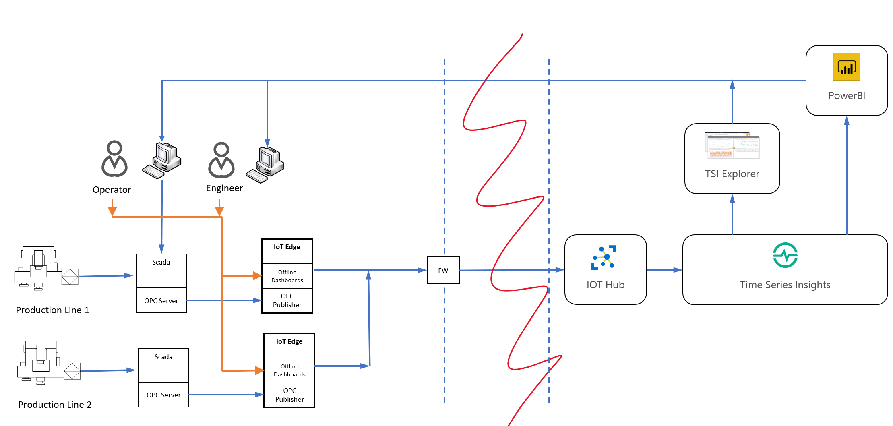

Offline Dashboards contains 3 modules:

1. A Node-Red module that collects data from OPC Publisher and writes that data into influxDB. Shout out to our IoT peers in Europe for the [IOT Edge nodered module](https://github.com/iotblackbelt/noderededgemodule) that enable this.
2. An influxDB module which stores data in time series structure
3. A Grafana module which serves data from influxDB in dashboards.

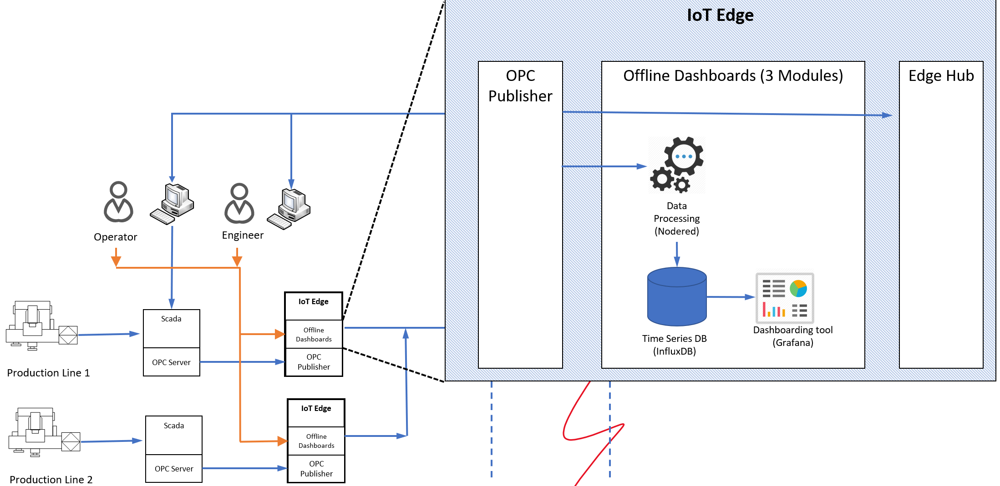

## Manufacturing KPIs

Offline Dashboards solution includes a sample dashboard to display following fundamental KPIs in manufacturing environment.

**Performance:** Performance KPI indicates if the machine is manufacturing  good items as much as it is expected. It is calculated as

```html
Performace = (Good Items Produced/Total Time Machine was Running)/(Ideal Rate of Production)
```

where "Ideal Rate of Production" is what we expect machine to perform. The unit of KPI is percentage and "Ideal Rate of Production" is provided as a parameter to dashboards.

**Quality:** Quality KPI gives you the ratio of good items produced by the machine over all items produced (i.e. good items produced and bad items produced). Calculation formula is

```html
Quality = (Good Items Produced)/(Good Items Produced + Bad Items Produced)
```

The unit of KPI is percentage.

**Availability:** Availability is defined as percentage of time the machine was available. Normally, this does not include any time periods where there is not any planned production. However, for the sake of simplicity, we assume here that our factory operates 24x7.

The calculation formula is

```html
Availability = (Running Time)/(Running Time + Idle Time)
```

The unit of KPI is percentage.

**OEE (Operational Equipment Efficiency):** Finally, OEE is a higher level KPI that is calculated from other KPIs above and depicts overall efficiency of equipment. The calculation formula is

```html
OEE = Availability x Quality x Performance
```

The unit of KPI is percentage.

## Sample Data Sources and Flow

The flow of data within the offline dashboards sample is depicted by green arrows in the following diagram.

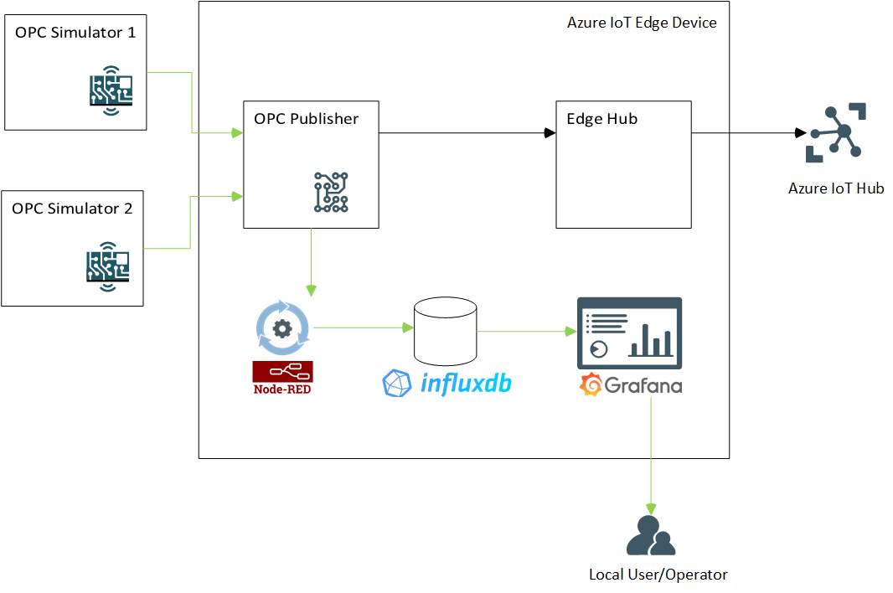

* Two simulators act as OPC servers
* OPC Publisher subscribes to 3 data points in OPC Servers
* Data collected by OPC Publisher is sent to cloud (through Edge Hub module) AND relayed to offline dashboards Node Red module for processing.
* Node-RED module unifies data format and writes data into InfluxDB
* Grafana dashboards read data from InfluxDB and display dashboards to operators/users.
* OPC Publisher, Node-RED module, InfluxDB and Grafana are all deployed as separate containers through IOT Edge runtime.
* For sake of simplicity, two OPC simulators are also deployed as node red modules in a container through IoT Edge runtime.

### OPC Simulator

This example solution uses an [OPC simulator](https://flows.nodered.org/node/node-red-contrib-opcua) to simulate data flow coming from machines in manufacturing environment.

OPC Simulator is a flow implemented in NodeRed. Two simulators are used to simulate two different OPC servers connected to the same IOT Edge device.

| OPC Simulator Flow 1                                  | OPC Simulator Flow 2                                  |
| ----------------------------------------------------- | ----------------------------------------------------- |
|  | 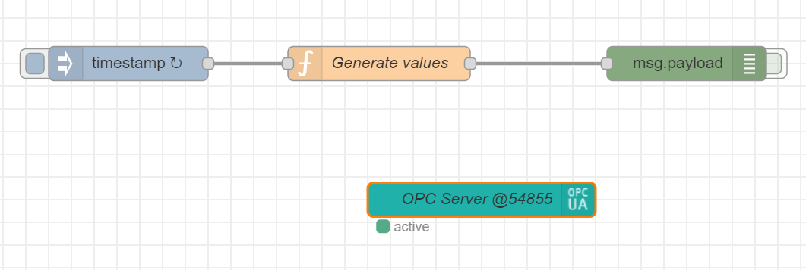 |

Simulators essentially have the same template but differentiated by two settings: Product URI and Port

|                      | Product URI | Port  |
| -------------------- | ----------- | ----- |
| OPC Simulator Flow 1 | OPC-Site-01 | 54845 |
| OPC Simulator Flow 2 | OPC-Site-02 | 54855 |

Three data points are generated by the simulators:

#### Data Point: STATUS

STATUS indicates the current status of device that OPC server is connected to.  STATUS values are randomly generated using following rules

* Value changes at least 10min intervals
* STATUS value is one of the following: 101,105,108, 102,104,106,107,109
* STATUS Values 101, 105, 108 mean machine is running
* STATUS Values 102,104,106,107,109 mean machine is not running
* Random number generator ensures machine will be in RUNNING state (i.e STATUS 101,105,108) 90% of the time

#### Data Point: ITEM_COUNT_GOOD

ITEM_COUNT_GOOD indicates number of good items (products that pass quality) produced by the machine since the last data point. It is a random whole number between 80-120. Simulators generate item counts every 5 secs. This could be taken in any unit that you wish but we will regard it as "number of items" in this example.

#### Data Point: ITEM_COUNT_BAD

ITEM_COUNT_BAD indicates number of bad items (ITEMS_DISCARDED) produced by the machine since the last data point. It is a random whole number between 0-10. Simulators generate item counts every 5 secs. This could be taken in any unit that you wish but we will regard it as "number of items" in this example.

### Data Processing Module (NodeRed)

Data collected from simulators by OPC publisher module are sent to NodeRed module for processing. NodeRed module does minimal processing as to validate data and convert to a suitable format and writes data into InfluxDB.

During processing Application URI value is extracted from JSON data and written to "Source" tag in the database schema.

### Database (InfluxDB)

All data collected flows into a single measurement (DeviceData) in a single database (telemetry) in InfluxDB. The measurement "DeviceData" has 3 fields and 1 tag:

Fields

* STATUS: float
* ITEM_COUNT_GOOD: float
* ITEM_COUNT_BAD: float

Tags

* Source

Note that STATUS values are preserved as they come from the OPC Server. We map these values to determine if machine is running with influx queries.

### Dashboard: Site Level Performance

Sie Level Performance dashboard displays key manufacturing KPIs (OEE, Availability, Quality, Performance) per site. 

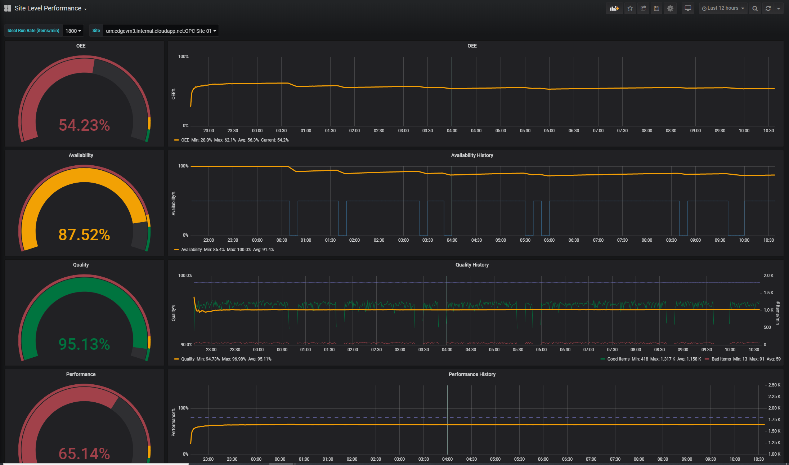

**Site** is basically defined as the OPC server that provides data and uses OPC Server's Application URI as the site name (Source). See Node Red module code for algorithm producing Application URI. In the sample application we have two different sites that corresponding to two OPC Simulators

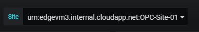

**Ideal run rate** is the ideal capacity of production for the equipment. It is used to calculate Performance KPI. See definition for Performance KPI for the calculation method.

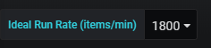

Each row in the dashboard represents a KPI. The gauge on the left hand side gives calculation of KPI as per the time window selected. In the example screenshot above, selected time window is "Last 12 hours". Therefore the left top gauge for OEE KPI says that OEE value is at 54.23% for the last 12 hours.

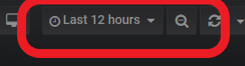

Normally operators would like to monitor KPIs for their current shift. To do that the operator has to set start of time period as start of their shift and leave end of time period as "now()", as shown in the snapshot below

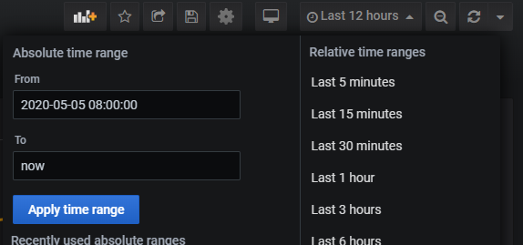

To make it easier, line graphs on the right column has vertical lines on 12:00AM, 08:00AM and 04:00PM to indicate working shift changes in our fictional facility.

Following table depicts details of each element in the dashboard

| Dashboard Element                                            |                           Snapshot                           |
| ------------------------------------------------------------ | :----------------------------------------------------------: |
| OEE gauge shows OEE KPI for the time period selected.        | 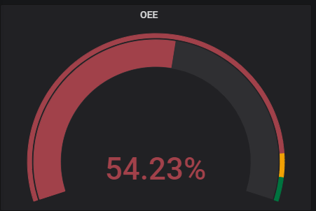 |
| OEE graph shows OEE value change across time period selected. Minimum, Maximum, Average values of OEE across time period are provided in the legend. | 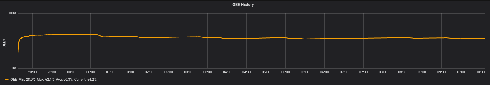 |
| Availability gauge shows Availability KPI for the time period selected. | 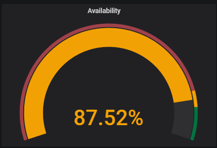 |
| Availability graph shows Availability value change across time period selected. Minimum, Maximum, Average values of Availability across time period are provided in the legend. The blue line indicates when machine was actually running. | 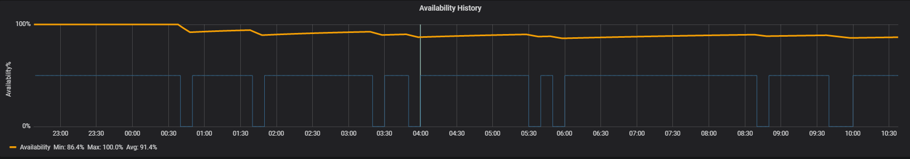 |
| Quality gauge shows Quality KPI for the time period selected. | 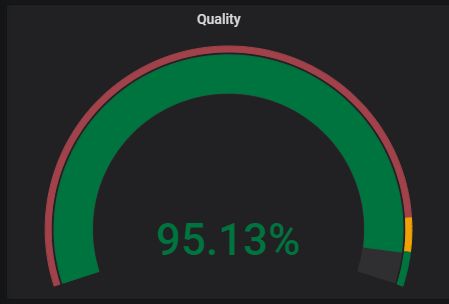 |
| Quality graph shows Quality value change across time period selected on the left axis. It also shows the number of "Good Items" produced (items that are properly manufactured, as green line) as well as "Bad Items" produced (items that are discarded, as red line) aligned to right axis. Contrary to Quality KPI "Good Items"  and "Bad Items" are aggregated at the minute level and their unit is number of items/min. "Ideal Run Rate" parameter value, entered manually at the top of dashboard, is shown as a reference line, again, aligned to the right axis. Minimum, Maximum, Average values of Quality, Good Items and Bad Items are provided in the legend. | 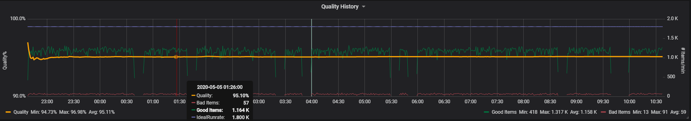 |
| Performance gauge shows Performance KPI for the time period selected. | 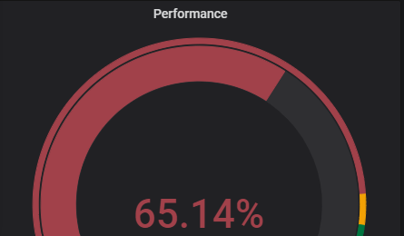 |
| Performance graph shows Performance value change across time period selected. Minimum, Maximum, Average values of Performance across time period are provided in the legend. "Ideal Run Rate" parameter value, entered manually at the top of dashboard, is shown as a reference line, again, aligned to the right axis. | 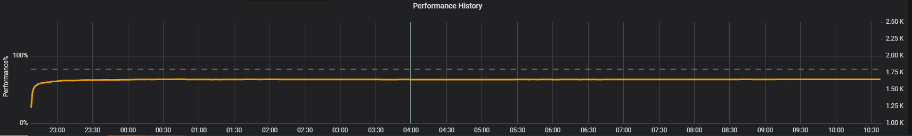 |

## Component Configuration

Each of the components in the solution are driven by configuration files contained in and deployed via their corresponding Docker images. As seen later in the module deployment, we use an Azure DevOps pipeline to automate creation of the Docker images and inclusion of the correct configuration files for each solution component.  This allows you to update the dashboard, for example, by updating the corresponding dashboard configuration file and executing the pipeline.

## Deployment

To deploy, we the newest version of the Azure IoT extension, called `azure-iot`. The legacy version is called `azure-iot-cli-ext`. You should only have one version installed at a time. You can use the command `az extension list` to validate the currently installed extensions.

Use `az extension remove --name azure-cli-iot-ext` to remove the legacy version of the extension.

Use `az extension add --name azure-iot` to add the new version of the extension.

### Create Resources

Create a resource group to manage all the resources used in this solution

```bash
az group create --name {resource_group} --location {datacenter_location}
```

Use following to create the IoT Hub resource. Detailed information can be found at: <https://docs.microsoft.com/en-us/azure/iot-edge/quickstart-linux>

```bash
az iot hub create  --resource-group {resource_group} --name {hub_name} --sku S1
```

Create a device identity for your IoT Edge device so that it can communicate with your IoT hub. The device identity lives in the cloud, and you use a unique device connection string to associate a physical device to a device identity. Detailed information can be found at: <https://docs.microsoft.com/en-us/azure/iot-edge/how-to-register-device>

```bash
az iot hub device-identity create --hub-name {hub_name} --device-id myEdgeDevice --edge-enabled
```

Retrieve the connection string for your device, which links your physical device with its identity in IoT Hub.

```bash
az iot hub device-identity show-connection-string --device-id myEdgeDevice --hub-name {hub_name}
```

Copy the value of the `connectionString` key from the JSON output and save it. This value is the device connection string. You'll use this connection string to configure the IoT Edge runtime in the next section.

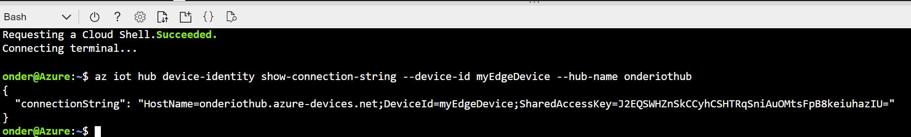

We will use a virtual machine as our IoT Edge device. Microsoft-provided [Azure IoT Edge on Ubuntu](https://azuremarketplace.microsoft.com/marketplace/apps/microsoft_iot_edge.iot_edge_vm_ubuntu) virtual machine image has everything preinstalled to run Azure IoT Edge, which preinstalls everything you need to run IoT Edge on a device. Accept the terms of use and create this virtual machine using the following command.

```bash
az vm image terms accept --urn microsoft_iot_edge:iot_edge_vm_ubuntu:ubuntu_1604_edgeruntimeonly:latest

az vm create --resource-group {resource_group} --name myEdgeVM --image microsoft_iot_edge:iot_edge_vm_ubuntu:ubuntu_1604_edgeruntimeonly:latest --admin-username azureuser --generate-ssh-keys
```

Use the edge device primary device connection string you noted above, to connect IoT Edge device to IoT Hub

```bash
az vm run-command invoke -g {resource_group} -n myEdgeVM --command-id Run ShellScript --script "/etc/iotedge/configedge.sh '{device_connection_string}'"
```

### Deploy Modules
